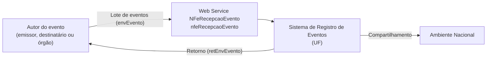
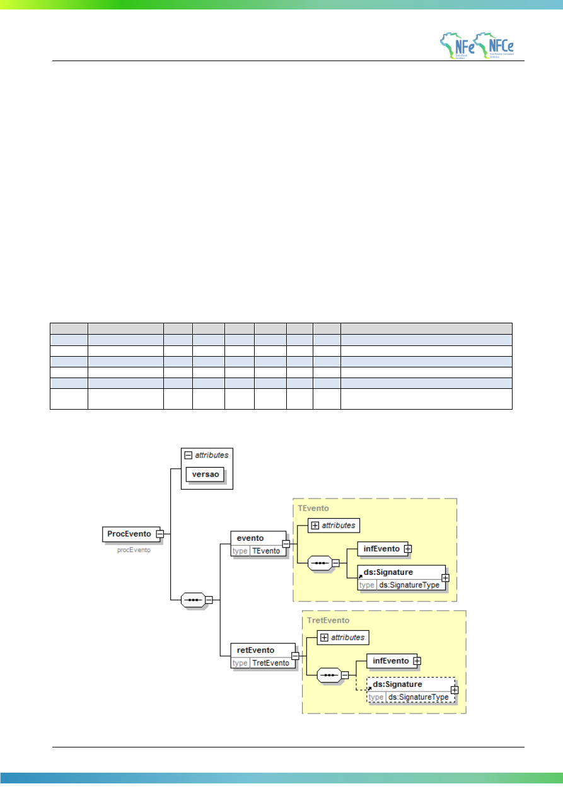

<!-- p.99 -->

# 5.8. Web Service – NFeRecepcaoEvento – Parte Geral

**Função:** Serviço destinado à recepção de mensagem de Evento da NF-e

**Processo:** síncrono.

**Método:** nfeRecepcaoEvento

<!-- p.100 -->

**Figura 5-9 – Fluxo do Web Service NFeRecepcaoEvento**

## 5.8.1. Leiaute Mensagem de Entrada (Parte Geral)

O Web Service de Registro de Evento possui uma interface genérica, complementada por uma área específica para cada tipo de evento. Segue abaixo o leiaute da parte geral da mensagem de entrada para os eventos.

**Schema XML: envEvento_v1.00.xsd**

**Tabela 5-32 – Leiaute Mensagem de Entrada de Evento, Parte Geral**

| # | Campo | Ele | Pai | Tipo | Ocor | Tam | Descrição/Observação |
|---|---|---|---|---|---|---|---|
| P01 | envEvento | Raiz | - | - | - | - | TAG raiz |
| P02 | versao | A | P01 | N | 1-1 | 2v2 | Versão do leiaute |
| P03 | idLote | E | P01 | N | 1-1 | 1-15 | Identificador de controle do Lote de envio do Evento. Número sequencial único para identificação do Lote, de uso exclusivo do autor do evento. O Web Service não faz qualquer uso deste identificador. |
| P04 | evento | G | P01 | xml | 1-20 | - | Evento, um lote pode conter até 20 eventos |
| P05 | versao | A | P04 | N | 1-1 | 2v2 | Versão do leiaute do evento |
| P06 | infEvento | G | P04 | - | 1-1 | - | Grupo de informações do registro do Evento |
| P07 | Id | ID | P06 | C | 1-1 | 54 | Identificador da TAG a ser assinada, formado por “ID” + tpEvento + Chave da NF-e + nSeqEvento |
| P08 | cOrgao | E | P06 | N | 1-1 | 2 | Código do órgão de recepção do Evento, conforme Tabela do IBGE ou: 91=Ambiente Nacional Informar o código da UF para este evento. |
| P09 | tpAmb | E | P06 | N | 1-1 | 1 | Identificação do Ambiente: 1=Produção/2=Homologação |
| P10 | CNPJ | CE | P06 | N | 1-1 | 14 | CNPJ do autor do evento |
| P11 | CPF | CE | P06 | N | 1-1 | 11 | CPF do autor do evento |
| P12 | chNFe | E | P06 | N | 1-1 | 44 | Chave de Acesso da NF-e à qual o evento será vinculado |
| P13 | dhEvento | E | P06 | D | 1-1 | - | Data e hora do evento no formato AAAA-MMDDThh:mm:ssTZD (UTC – Universal Coordinated Time) |
| P14 | tpEvento | E | P06 | N | 1-1 | 6 | Código do evento (de acordo com tabelas do item 3.1) |
| P15 | nSeqEvento | E | P06 | N | 1-1 | 1-2 | Sequencial do evento para o mesmo tipo de evento. Informar o valor “1” para este evento. |
| P16 | verEvento | E | P06 | N | 1-1 | 2v2 | Versão do grupo de detalhe do evento. |
| P17 | detEvento | G | P06 | | 1-1 | - | Detalhes do evento. Inserir neste local o XML específico do tipo de evento (ex: cancelamento, carta correção, registro de passagem). |
| <!-- p.101 --> P91 | Signature | G | P04 | xml | 1-1 | - | Assinatura Digital do documento XML, a assinatura deverá ser aplicada no elemento infEvento |

## 5.8.2. Leiaute Mensagem de Retorno (Parte Geral)

Retorno: Estrutura XML com a mensagem do resultado da transmissão.

**Schema XML: retEnvEvento_v1.00.xsd**

**Tabela 5-33 – Leiaute Mensagem de Retorno de Evento, Parte Geral**

| # | Campo | Ele | Pai | Tipo | Ocorr | Tam | Descrição/Observação |
|---|---|---|---|---|---|---|---|
| R01 | retEnvEvento | Raiz | - | - | - | - | TAG raiz da mensagem de retorno |
| R02 | versao | A | R01 | N | 1-1 | 2v2 | Versão do leiaute |
| R03 | idLote | E | R01 | N | 1-1 | 1-15 | Idem a mensagem de entrada. |
| R04 | tpAmb | E | R01 | N | 1-1 | 1 | Idem a mensagem de entrada. |
| R05 | verAplic | E | R01 | C | 1-1 | 1-20 | Versão da aplicação que processou o evento. |
| R06 | cOrgao | E | R01 | N | 1-1 | 2 | Órgão de recepção do Evento, idem a mensagem de entrada. |
| R07 | cStat | E | R01 | N | 1-1 | 3 | Código do status da resposta (conforme item 4.4.1 do documento MOC – Anexo I – Leiaute NF-e/NFC-e) |
| R08 | xMotivo | E | R01 | C | 1-1 | 1-255 | Descrição do status da resposta |
| R09 | retEvento | G | R01 | - | 0-20 | - | Grupo do resultado do processamento do Evento |
| R10 | versao | A | R09 | N | 1-1 | 2v2 | Versão do leiaute |
| R11 | infEvento | G | R09 | | 1-1 | - | Grupo de informações do registro do Evento |
| R12 | Id | ID | R11 | C | 0-1 | 17 | Identificador da TAG a ser assinada, somente deve ser informado se o órgão de registro assinar a resposta. No caso de assinatura, preencher com o número do protocolo, precedido pela literal “ID” |
| R13 | tpAmb | E | R11 | N | 1-1 | 1 | Idem a mensagem de entrada. |
| R14 | verAplic | E | R11 | C | 1-1 | 1-20 | Versão da aplicação que registrou o Evento, utilizar literal que permita a identificação do órgão, como a sigla da UF ou do órgão. |
| R15 | cOrgao | E | R11 | N | 1-1 | 2 | Idem a mensagem de entrada. |
| R16 | cStat | E | R11 | N | 1-1 | 3 | Código do status da resposta (conforme item 4.4.1 do documento MOC – Anexo I – Leiaute NF-e/NFC-e) |
| R17 | xMotivo | E | R11 | C | 1-1 | 1-255 | Descrição do status da resposta. |
| R18 | chNFe | E | R11 | N | 0-1 | 44 | Idem a mensagem de entrada. |
| R19 | tpEvento | E | R11 | N | 0-1 | 6 | Código do evento (de acordo com tabelas do item 3.1) |
| R20 | xEvento | E | R11 | C | 0-1 | 5-60 | Descrição do resultado do processamento do evento |
| R21 | nSeqEvento | E | R11 | N | 0-1 | 1-2 | Idem a mensagem de entrada. |
| R22 | cOrgaoAutor | E | R11 | N | 0-1 | 2 | Idem a mensagem de entrada, para os casos de eventos em que é informado na mensagem de entrada. Específico para eventos: - 110112 – Cancelamento por substituição (NT 2018.005) - 110140 – EPEC Obs: Esta tag não é preenchida no evento de manifestação |
| R23 | CNPJDest | CE | R11 | N | 0-1 | 14 | Informar o CNPJ do destinatário da NF-e. Específico para evento 110111 – Cancelamento |
| R24 | CPFDest | CE | R11 | N | 0-1 | 11 | Informar o CPF do destinatário da NF-e. Específico para evento 110111 – Cancelamento Obs: Esta tag não é preenchida no evento de manifestação |
| <!-- p.102 --> R25 | emailDest | E | R11 | C | 0-1 | 1-60 | E-mail do destinatário informado na NF-e. Específico para eventos 110111 – Cancelamento Obs: Esta tag não é preenchida no evento de manifestação |
| R30 | dhRegEvento | E | R11 | D | 1-1 | - | Data e hora de registro do evento no formato AAAA-MMDDTHH:MM:SSTZD (formato UTC). Se o evento for rejeitado informar a data e hora de recebimento do evento. |
| R31 | nProt | E | R11 | N | 0-1 | 15 | Número do Protocolo do Evento, conforme item 4.3.5 |
| R32 | chNFePend | E | R11 | N | 0-50 | 44 | Relação de Chaves de Acesso de EPEC pendentes de conciliação, existentes no AN. Específico para evento: 110140 – EPEC Obs: Esta tag não é preenchida no evento de manifestação |
| R91 | Signature | G | R09 | XML | 0-1 | - | Assinatura Digital do documento XML, a assinatura deverá ser aplicada no elemento infEvento. A decisão de assinar a mensagem fica a critério da UF. |

## 5.8.3. Descrição do Processo de Web Service

O WS de Eventos é acionado pelo interessado emissor da NF-e que deve enviar mensagem de registro de evento.

O processo de Registro de Eventos recebe eventos em uma estrutura de lotes, que podem conter de 1 a 20 eventos.

## 5.8.4. Regras de Validação Genéricas Para Todos os Eventos

Serão aplicadas as regras de validação genéricas conforme os grupos citados na Tabela 5-34, detalhados no documento MOC – Anexo I – Leiaute e Regras de Validação da NF-e e da NFC-e.

**Tabela 5-34 – Regras de Validação Genéricas do Web Service NFeRecepcaoEvento**

| Grupo | Descrição |
|---|---|
| A | Validação do Certificado de Transmissão (protocolo TLS) |
| B | Validação Inicial da Mensagem no Web Service |
| D | Validação da Área de Dados |
| E | Validação do Certificado Digital de Assinatura |
| F | Validação da Assinatura Digital |

A validação do Schema XML é realizada em toda mensagem de entrada, mas como existe uma parte da mensagem que é variável pode ocorrer erro de falha de Schema XML da parte específica da mensagem que será identificado posteriormente.

As regras de validação da parte geral deste WS podem ser vistas na Tabela 5-35 (NT 2018.004); as regras de validação específicas para cada evento estão tratadas nas seções relativas a cada um deles.

**Tabela 5-35 – Regras de Validação da Parte Geral do Web Service NFeRecepcaoEvento**

| # | Regra de Validação | Aplic. | Msg | Efeito | Descrição Erro |
|---|---|---|---|---|---|
| P07-10 | Atributo “Id” não corresponde à concatenação dos campos do evento (“ID” + tpEvento + chNFe + nSeqEvento) (\*1) | Obrig. | 572 | Rej. | Rejeição: Erro Atributo ID do evento não corresponde a concatenação dos campos (“ID” + tpEvento + chNFe + nSeqEvento) |
| P08-10 | Código do órgão de recepção do Evento diverge do definido para este evento (\*1) | Obrig. | 250 | Rej. | Rejeição: UF diverge da UF autorizadora |
| P09-10 | Tipo do ambiente difere do ambiente do Web Service (\*1) | Obrig. | 252 | Rej. | Rejeição: Ambiente informado diverge do Ambiente de recebimento |
| <!-- p.103 --> P10-10 | Se informado CNPJ do Autor do Evento: • CNPJ inválido (zeros, nulo ou DV inválido) (\*1) | Obrig. | 489 | Rej. | Rejeição: CNPJ informado inválido (DV ou zeros) |
| P11-10 | Se informado o CPF do Autor do evento: • CPF inválido (zeros, nulo ou DV inválido) (\*1) | Obrig. | 490 | Rej. | Rejeição: CPF informado inválido (DV ou zeros) |
| P11-20 | Se informado o CPF do Autor do evento e Modelo da Chave de Acesso = 65: • Evento não disponível para Autor tipo pessoa física (\*1) | Obrig. | 408 | Rej. | Rejeição: Evento não disponível para Autor pessoa física |
| P12-10 | Validação da Chave de Acesso (tag:chNFe): • Dígito verificador inválido (\*1) | Obrig. | 236 | Rej. | Rejeição: Chave de Acesso com dígito verificador inválido |
| P12-14 | • Código UF inválido (\*1) | Obrig. | 614 | Rej. | Rejeição: Chave de Acesso inválida (Código UF inválido) |
| P12-18 | • Ano < 06 ou Ano maior que Ano corrente (\*1) | Obrig. | 615 | Rej. | Rejeição: Chave de Acesso inválida (Ano < 06 ou Ano maior que Ano corrente) |
| P12-22 | • Mês = 0 ou Mês > 12 (\*1) | Obrig. | 616 | Rej. | Rejeição: Chave de Acesso inválida (Mês < 1 ou Mês > 12) |
| P12-26 | • CNPJ/CPF zerado ou dígito inválido (\*1) Nota: Considerar a Série para determinar se CNPJ/CPF na Chave de Acesso. CNPJ: Série=[0-909], CPF: Série<>[0-909] | Obrig. | 617 | Rej. | Rejeição: Chave de Acesso inválida (CNPJ/CPF zerado ou dígito inválido) |
| P12-30 | • Modelo diferente de 55 ou 65 (\*1) | Obrig. | 618 | Rej. | Rejeição: Chave de Acesso inválida (modelo diferente de 55/65) |
| P12-34 | • Número NF = 0 (\*1) | Obrig. | 619 | Rej. | Rejeição: Chave de Acesso inválida (número NF = 0) |
| P12-40 | • UF da Chave de Acesso diverge da UF Autorizadora | Obrig. | 249 | Rej. | Rejeição: UF da Chave de Acesso diverge da UF autorizadora |
| P12-44 | • CNPJ/CPF do Autor diverge do CNPJ/CPF da Chave de Acesso Nota: Considerar a Série para determinar se CNPJ/CPF na Chave de Acesso. CNPJ: Série=[0-909], CPF: Série<>[0-909] | Obrig. | 574 | Rej. | Rejeição: Autor do evento diverge do emissor da NF-e |
| P13-10 | Data do evento maior que a data de processamento (aceitar tolerância de até 5 minutos) (\*1) | Obrig. | 578 | Rej. | Rejeição: A data do evento não pode ser maior que a data do processamento |
| | **Banco de Dados: Emitente** | | | | |
| 1P10-10 | Acesso ao Cadastro de Contribuintes (Chave: CNPJ do Autor): • Verificar se Emitente não autorizado a emitir NF-e | Obrig. | 203 | Rej. | Rejeição: Emissor não habilitado para emissão de NF-e |
| 1P10-20 | • Verificar situação fiscal do emitente | Obrig. | 240 | Rej. | Rejeição: Irregularidade fiscal do emitente |
| | **Banco de Dados: Evento** | | | | |
| 3P15-10 | Acesso BD de Eventos (Chave: Chave de Acesso, tpEvento, nSeqEvento): • Duplicidade do evento (tpEvento + chNFe + nSeqEvento) (\*1) | Obrig. | 573 | Rej. | Rejeição: Duplicidade de Evento |

\*1 ...... Validações genéricas do Registro de Evento.

## 5.8.5. Final do Processamento do Lote

O processamento do lote pode resultar em:

- Rejeição do Lote – por algum problema que comprometa o processamento do lote;
- Processamento do Lote – o lote foi processado (cStat=128), a validação de cada evento do lote poderá resultar em:
  - Rejeição – o Evento será descartado, com retorno do código do status do motivo da rejeição;
  - <!-- p.104 -->Recebido pelo Sistema de Registro de Eventos, com vinculação do evento na NF-e, o Evento será armazenado no repositório do Sistema de Registro de Eventos com a vinculação do Evento à respectiva NF-e (cStat=135);
  - Recebido pelo Sistema de Registro de Eventos – vinculação do evento à respectiva NF-e prejudicada – o Evento será armazenado no repositório do Sistema de Registro de Eventos, a vinculação do evento à respectiva NF-e fica prejudicada face à inexistência da NF-e no momento do recebimento do Evento (cStat=136);

A UF que recepcionar o Evento deve enviá-lo para o Sistema de Compartilhamento do AN – Ambiente Nacional – para que o Evento seja distribuído para todos os interessados.

A resposta da SEFAZ pode ser assinada e neste caso deve ser preenchido o atributo "Id' (HR12). Este atributo é opcional e não deve ser informado pela SEFAZ caso a mensagem de resposta não seja assinada. Esta orientação é válida para todos os tipos de evento.

## 5.8.6. Armazenamento e Disponibilização do Evento

O arquivo digital do Evento, com a respectiva informação do Registro de Evento da SEFAZ, deve ser mantido pelo emissor e disponibilizado para o destinatário, na forma da Tabela 5-36.

**Schema XML: procEventoNFe_v1.00.xsd**

**Tabela 5-36 – Leiaute da Informação do Registro de Evento**

| # | Campo | Ele | Pai | Tipo | Ocor. | Tam. | Dec. | Descrição/Observação |
|---|---|---|---|---|---|---|---|---|
| ZR01 | procEventoNFe | Raiz | - | - | - | - | - | TAG raiz |
| ZR02 | versao | A | ZR01 | N | 1-1 | 1-4 | 2 | |
| ZR03 | evento | G | ZR01 | - | 1-1 | - | - | |
| YR04 | (dados) | - | - | - | - | - | - | Dados do Evento (mensagem de entrada) |
| YR05 | retEvento | G | ZR01 | - | 1-1 | - | - | |
| YR06 | (dados) | - | - | - | - | - | - | Dados do registro do Evento (mensagem de saída) |

**Figura 5-10 – Diagrama Simplificado do procEventoNFe**

