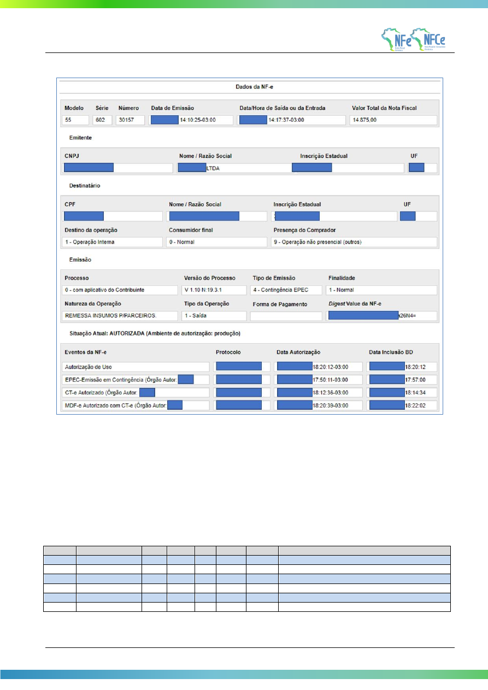

<!-- p.126 -->

# 7.3. Exibição de EPEC na Consulta Pública

## 7.3.1. Evento EPEC com a Respectiva NF-e

Caso a NF-e referente ao EPEC já tenha sido autorizada, a Consulta Pública da NF-e deverá ser visualizada normalmente, mostrando também a existência do evento de emissão em contingência.

<!-- p.127 -->

**Figura 7-1 – Visualização de um Evento Prévio de Emissão em Contingência**

## 7.3.2. Evento EPEC sem a Respectiva NF-e

Caso exista unicamente o EPEC, a Consulta Pública da NF-e deverá mostrar os dados do EPEC, visualizando unicamente a Aba NF-e, com as informações existentes.
