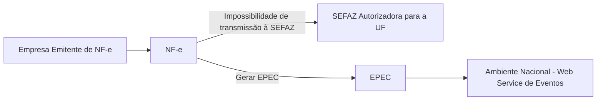

# 3. Emissão do EPEC

## 3.1 Visão Geral

*Figura 3.1 – EPEC: visão geral*

A emissão do EPEC poderá ser adotada por qualquer emissor que esteja impossibilitado de transmissão e/ou recepção das autorizações de uso de suas NF-e, adotando os seguintes passos:

- Gerar a NF-e com "tpEmis = 4", mantendo também a informação do motivo de entrada em contingência com data e hora do início da contingência, com número diferente de qualquer NF-e que tenha sido transmitida com outro "tpEmis";
- Gerar o arquivo XML do EPEC conforme especificado no item 3.2;
- Assinar o arquivo com o certificado digital do emitente;
- Enviar o arquivo XML do EPEC para o Web Service de Registro de Eventos do AN;
- <!-- p.6 -->Impressão do DANFE da NF-e que consta do EPEC, em papel comum, constando no corpo a expressão "DANFE impresso em contingência - DPEC regularmente recebida pela Receita Federal do Brasil".

Obtida a autorização do Evento (Número do Protocolo: 891xxxxxxxxxxxx), a exemplo do que ocorre com outros eventos da NF-e, este evento também será distribuído para as UF envolvidas na operação, inclusive para a própria UF do emitente.

Após a cessação dos problemas técnicos que impediam a transmissão da NF-e para UF de origem, a NF-e que deu origem a necessidade de uso da Contingência Eletrônica "EPEC" deverá ser transmitida para a SEFAZ de origem, observando o prazo limite de transmissão na legislação, bem como outros procedimentos constantes na legislação caso ocorra rejeição na autorização de uso.

Nota: A Chave de Acesso desta NF-e é exatamente a mesma Chave de Acesso do EPEC autorizado anteriormente.

## 3.1a Informações complementares

**A. Endereço do Web Service**

O endereço do Web Service de Eventos do Ambiente Nacional está publicado no Portal da NF-e (http://www.nfe.fazenda.gov.br/portal), no link "Serviços" / "Relação de Serviços Web".

Idem para o ambiente de homologação, no Portal de Homologação (http://hom.nfe.fazenda.gov.br/portal)

**B. Entrada em Contingência**

A decisão da empresa de começar a usar a contingência do EPEC é tomada quando a empresa não recebe a resposta de uma determinada NF-e com pedido de autorização de uso, ou quando não consegue determinar se o pedido foi ou não corretamente enviado.

**C. Impressão do DANFE**

Deverá ser impresso no DANFE o número do Protocolo de Autorização do Evento de EPEC, além do motivo e a hora da entrada em contingência.

O DANFE deverá ser impresso em duas vias que terão a seguinte destinação:

- Uma via permite o trânsito das mercadorias e deverá ser mantida pelo destinatário;
- A outra via deverá ser mantida pelo emitente.

Estas vias deverão ser mantidas em arquivo pelo emitente e pelo destinatário, durante o prazo estabelecido na legislação tributária para a guarda de documentos fiscais.

**D. Lote de EPEC**

Como é utilizado o Web Service genérico de registro de evento é possível registrar os eventos de EPEC para até 20 NF-e diferentes em uma mesma conexão, sendo um EPEC para cada NF-e.

## 3.2 Leiaute Mensagem de Entrada

O Web Service de Registro de Evento possui uma interface genérica, complementada por uma área específica para cada tipo de evento. Segue abaixo o leiaute da mensagem de entrada para este evento.

**Schema XML: eventoEPEC_v9.99.xsd**

| # | Campo | Ele | Pai | Tipo | Ocor. | Tam. | Descrição/Observação |
|---|---|---|---|---|---|---|---|
| **P01** | **envEvento** | **Raiz** | **-** | **-** | **-** | **-** | **TAG raiz** |
| P02 | versao | A | P01 | N | 1-1 | 2v2 | Versão do leiaute |
| P03<!-- p.7 --> | idLote | E | P01 | N | 1-1 | 1-15 | Identificador de controle do Lote de envio do Evento. Número sequencial único para identificação do Lote. |
| **P04** | **evento** | **G** | **P01** | **xml** | **1-20** | **-** | **Evento, um lote pode conter até 20 eventos** |
| P05 | versao | A | P04 | N | 1-1 | 2v2 | Versão do leiaute do evento |
| **P06** | **infEvento** | **G** | **P04** | | **1-1** | | **Grupo de informações do registro do Evento** |
| P07 | Id | ID | P06 | C | 1-1 | 54 | Identificador da TAG a ser assinada, a regra de formação do Id é: "ID" + tpEvento + Chave da NF-e + nSeqEvento |
| P08 | cOrgao | E | P06 | N | 1-1 | 2 | Código do órgão de recepção do Evento. Utilizar 91 para identificar o Ambiente Nacional. |
| P09 | tpAmb | E | P06 | N | 1-1 | 1 | Identificação do Ambiente: 1=Produção /2=Homologação |
| P10 | CNPJ | CE | P06 | N | 1-1 | 14 | Informar o CNPJ / CPF do Autor do Evento (CNPJ da Empresa Emitente). |
| P11 | CPF | CE | P06 | N | 1-1 | 11 | |
| P12 | chNFe | E | P06 | N | 1-1 | 44 | Para o evento de EPEC, a posição 35 da Chave de Acesso deve ser 4 (tpEmis=4). |
| P13 | dhEvento | E | P06 | D | 1-1 | | Data e hora do evento no formato AAAA-MM-DDThh:mm:ssTZD (UTC - Universal Coordinated Time). |
| P14 | tpEvento | E | P06 | N | 1-1 | 6 | Código do evento: 110140 - "EPEC" |
| P15 | nSeqEvento | E | P06 | N | 1-1 | 1-2 | Informar o valor "1" para o evento do EPEC. |
| P16 | verEvento | E | P06 | N | 1-1 | 2v2 | Versão do detalhe do evento (grupo detEvento - P17), informação usada pela SEFAZ para validar o grupo detEvento. |
| **P17** | **detEvento** | **G** | **P06** | | **1-1** | | **Informações de detalhes do evento** |
| P18 | versao | A | P17 | N | 1-1 | 2v2 | Informar o mesmo valor da tag verEvento (P16). |
| P19 | descEvento | E | P17 | C | 1-1 | 5-60 | "EPEC" |
| P20 | cOrgaoAutor | E | P17 | N | 1-1 | 2 | Código do Grgão do Autor do Evento. Nota: Informar o código da UF do Emitente para este evento. |
| P21 | tpAutor | E | P17 | N | 1-1 | 1 | Informar “1=Empresa Emitente/~~Pessao~~ Pessoa Fisica” para este evento Nota: 1=Empresa Emitente/Pessoa Fisica; 2=Empresa destinatária; 3=Empresa; 5=Fisco; 6=RFB;9=Outros Orgãos |
| P22 | verAplic | E | P17 | C | 1-1 | 1-20 | Versão do aplicativo do Autor do Evento. |
| P23 | dhEmi | E | P17 | D | 1-1 | | Data e hora no formato UTC (Universal Coordinated Time): "AAAA-MM-DDThh:mm:ss TZD". |
| P24 | tpNF | E | P17 | N | 1-1 | 1 | 0=Entrada; 1 =Saída; |
| P25 | IE | E | P17 | N | 1-1 | 2-14 | IE do Emitente |
| **P26** | **dest** | **G** | **P17** | | **1-1** | | |
| P27 | UF | E | P26 | C | 1-1 | 2 | Sigla da UF do destinatário. Informar "EX" no caso de operação com o exterior. |
| P28 | CNPJ | CE | P26 | N | 1-1 | 14 | Informar o CPF ou o CNPJ do destinatário, preenchendo os zeros não significativos. No caso de operação com exterior, ou para comprador estrangeiro, informar a tag "idEstrangeiro", com o número do passaporte, ou outro documento legal (campo aceita valor Nulo no caso de operação com exterior). |
| P29 | CPF | CE | P26 | N | 1-1 | 11 | |
| P30 | idEstrangeiro | CE | P26 | C | 1-1 | 0, 5-20 | |
| P31 | IE | E | P26 | N | 0-1 | 2-14 | Informar a IE do destinatário somente quando o contribuinte destinatário possuir uma inscrição estadual. Omitir a tag no caso de destinatário "ISENTO", ou destinatário não possuir IE. |
| P32 | vNF | E | P17 | N | 1-1 | 13v2 | Valor total da NF-e |
| P33 | vICMS | E | P17 | N | 1-1 | 13v2 | Valor total do ICMS |
| P34 | vST | E | P17 | N | 1-1 | 13v2 | Valor total do ICMS de Substituição Tributária |
| **P91** | **Signature** | **G** | **P04** | **XML** | **1-1** | | **Assinatura Digital do documento XML, a assinatura deverá ser aplicada no elemento infEvento** |

> **Revogado/Descontinuado:** em P21 (tpAutor), a grafia “Pessao” está riscada no original e foi substituída por “Pessoa Fisica”.

## 3.3 Leiaute Mensagem de Retorno

O Web Service de Registro de Evento possui uma interface genérica, complementada por uma área específica para cada tipo de evento. Segue abaixo o leiaute da mensagem de retorno (resposta) para este evento.

**Schema XML: retEventoEPEC_v9.99.xsd**

<!-- p.8 -->
| # | Campo | Ele | Pai | Tipo | Ocor. | Tam. | Descrição/Observação |
|---|---|---|---|---|---|---|---|
| **R01** | **retEnvEvento** | **Raiz** | **-** | **-** | **-** | **-** | **TAG raiz da mensagem de retorno** |
| R02 | versao | A | R01 | N | 1-1 | 2v2 | Versão do leiaute |
| R03 | idLote | E | R01 | N | 1-1 | 1-15 | Identificador de controle do Lote de envio do Evento, conforme informado na mensagem de entrada. |
| R04 | tpAmb | E | R01 | N | 1-1 | 1 | Identificação do Ambiente: 1=Produção /2=Homologação |
| R05 | verAplic | E | R01 | C | 1-1 | 1-20 | Versão da aplicação que processou o evento. |
| R06 | cOrgao | E | R01 | N | 1-1 | 2 | Código da UF que registrou o Evento. Utilizar 91 para o Ambiente Nacional. |
| R07 | cStat | E | R01 | N | 1-1 | S | Código do status da resposta |
| R08 | xMotivo | E | R01 | C | 1-1 | 1-255 | Descrição do status da resposta |
| **R09** | **retEvento** | **G** | **R01** | | **0-20** | | **TAG de grupo do resultado do processamento do Evento** |
| R10 | versao | A | R09 | N | 1-1 | 2v2 | Versão do leiaute |
| **R11** | **infEvento** | **G** | **R09** | | **1-1** | | **Grupo de informações do registro do Evento** |
| R12 | Id | ID | R11 | C | 0-1 | 17 | Identificador da TAG a ser assinada, somente deve ser informado se o órgão de registro assinar a resposta. Em caso de assinatura da resposta pelo órgão de registro, preencher com o número do protocolo, precedido pela literal "ID" |
| R13 | tpAmb | E | R11 | N | 1-1 | 1 | Identificação do Ambiente: 1=Produção /2=Homologação |
| R14 | verAplic | E | R11 | C | 1-1 | 1-20 | Versão da aplicação que registrou o Evento, utilizar literal que permita a identificação do órgão, como a sigla da UF ou do órgão. |
| R15 | cOrgao | E | R11 | N | 1-1 | 2 | Código da UF que registrou o Evento. Utilizar 91 para o Ambiente Nacional. |
| R16 | cStat | E | R11 | N | 1-1 | S | Código do status da resposta. |
| R17 | xMotivo | E | R11 | C | 1-1 | 1-255 | Descrição do status da resposta. |
| R18 | chNFe | E | R11 | N | 0-1 | 44 | Chave de Acesso da NF-e vinculada ao evento. |
| R19 | tpEvento | E | R11 | N | 0-1 | B | 110140 - "EPEC" |
| R20 | xEvento | E | R11 | C | 0-1 | 5-60 | "EPEC autorizado" |
| R21 | nSeqEvento | E | R11 | N | 0-1 | 1-2 | Sequencial do evento, conforme a mensagem de entrada. |
| R22 | cOrgaoAutor | E | R11 | N | 0-1 | 2 | Idem a mensagem de entrada. |
| R30 | dhRegEvento | E | R11 | D | 1-1 | | Data e hora de registro do evento no formato AAAA-MM-DDTHH:MM:SSTZD (formato UTC, onde TZD é +HH:MM ou -HH:MM). Se o evento for rejeitado informar a data e hora de recebimento do evento. |
| R31 | nProt | E | R11 | N | 0-1 | 1S | Número do Protocolo do Evento 1 posição (1=Secretaria da Fazenda Estadual, 2=RFB), 2 posições para o código da UF, 2 posições para o ano e 10 posições para o sequencial no ano. |
| R32 | chNFePend | E | R11 | N | 0-50 | 44 | Relação de Chaves de Acesso de EPEC pendentes de conciliação, existentes no AN. |
| **R91** | **Signature** | **G** | **R09** | **XML** | **0-1** | | **Assinatura Digital do documento XML, a assinatura deverá ser aplicada no elemento infEvento. A decisão de assinar a mensagem fica a critério da UF/RFB.** |

Nota 1: No caso de evento registrado com sucesso, os campos opcionais serão retornados.

Nota 2: A relação de Chaves de Acesso pendentes de conciliação (tag:chNFePend) será disponibilizada sempre que o ambiente de autorização do EPEC estiver bloqueado para o CNPJ do emitente (Rejeição "142-Ambiente de Contingência EPEC bloqueado para o Emitente".

## 3.4 Descrição do Processo de Recepção de Evento

O processo de Registro de Eventos recebe eventos em uma estrutura de lotes, que pode conter de 1 a 20 eventos. Normalmente este evento será feito de forma on-line para cada necessidade de autorização de EPEC (lote com somente 1 ocorrência).

## 3.5 Validação do Certificado de Transmissão

Regras de validação idênticas aos demais Web Services, podendo gerar os erros:

- 280: "Rejeição: Certificado Transmissor inválido"
- <!-- p.9 -->281: "Rejeição: Certificado Transmissor Data Validade"
- 282: "Rejeição: Certificado Transmissor sem CNPJ/CPF"
- 283: "Rejeição: Certificado Transmissor - erro Cadeia de Certificação"
- 284: "Rejeição: Certificado Transmissor revogado"
- 285: "Rejeição: Certificado Transmissor difere ICP-Brasil"
- 286: "Rejeição: Certificado Transmissor erro no acesso a LCR"

## 3.6 Validação inicial da Mensagem no Web Services

Regras de validação idênticas aos demais Web Services, podendo gerar os erros:

- 108: “Rejeição: Serviço Paralisado Momentaneamente (curto prazo)”
- 109: "Serviço Paralisado sem Previsão"
- 214: "Rejeição: Tamanho da mensagem excedeu o limite estabelecido"
- 239: “Rejeição: Versão do arquivo XML não suportada”
- 243: “Rejeição: XML Mal Formado”
- 410: “Rejeição: UF informada no campo cUF não é atendida pelo WebService”

## 3.7 Validação da Área de Dados

**a) Validação de forma da área de dados**

Regras de validação idênticas aos demais Web Services, podendo gerar os erros:

- 215: "Rejeição: Falha Schema XML"
- 225: “Rejeição: Falha no Schema XML do lote de NFe”
- 404: "Rejeição: Uso de prefixo de namespace não permitido"
- 402: "Rejeição: XML da área de dados com codificação diferente de UTF-8"
- 516: "Rejeição: Falha Schema XML, inexiste a tag raiz esperada para a mensagem"
- 517: "Rejeição: Falha Schema XML, inexiste atributo versão na tag raiz da mensagem"
- 587: "Rejeição: Usar somente o namespace padrão da NF-e"
- 588: "Rejeição: Não é permitida a presença de caracteres de edição no início/fim da mensagem ou entre as tags da mensagem"

**b) Extração dos eventos do lote e validação do Schema XML do evento**

Regras de validação idênticas aos demais Eventos, podendo gerar os erros:

- 491: "Rejeição: O tpEvento informado invalido"
- 492: "Rejeição: O verEvento informado invalido"
- 493: "Rejeição: Evento não atende o Schema XML específico"

**c) Validação do Certificado Digital de Assinatura**

Regras de validação idênticas aos demais Web Services, podendo gerar os erros:

- 290: "Rejeição: Certificado Assinatura inválido"
- 291: "Rejeição: Certificado Assinatura Data Validade"
- 292: "Rejeição: Certificado Assinatura sem CNPJ/CPF"
- 293: "Rejeição: Certificado Assinatura - erro Cadeia de Certificação"
- 294: "Rejeição: Certificado Assinatura revogado"
- 295: "Rejeição: Certificado Assinatura difere ICP-Brasil"
- 296: "Rejeição: Certificado Assinatura erro no acesso a LCR"

**d) Validação da Assinatura Digital**

Regras de validação idênticas aos demais Web Services, podendo gerar os erros:

- 213: "Rejeição: CNPJ-Base do Autor difere do CNPJ-Base do Certificado Digital"
- 227: “Rejeição: CPF do emitente difere do CPF do Certificado Digital”
- 297: "Rejeição: Assinatura difere do calculado"
- <!-- p.10 -->298: "Rejeição: Assinatura difere do padrão do Projeto"

## 3.8 Validações gerais do WS NfeRecepcaoEvento

| # | Modelo | Regra de Validação | Aplic. | Msg | Descrição Erro |
|---|---|---|---|---|---|
| P07-10 | 55 | Atributo “Id” não corresponde à concatenação dos campos do evento (“ID” + tpEvento + chNFe + nSeqEvento) (*1) | Obrig. | 572 | Rejeição: Erro Atributo ID do evento não corresponde a concatenação dos campos (“ID” + tpEvento + chNFe + nSeqEvento) |
| P08-10 | 55 | Código do órgão de recepção do Evento diverge do definido para este evento (*1) | Obrig. | 250 | Rejeição: UF diverge da UF autorizadora |
| P09-10 | 55 | Tipo do ambiente difere do ambiente do Web Service (*1) | Obrig. | 252 | Rejeição: Ambiente informado diverge do Ambiente de recebimento |
| P10-10 | 55 | Se informado CNPJ do Autor do Evento: - CNPJ inválido (zeros, nulo ou DV inválido) (*1) | Obrig. | 489 | Rejeição: CNPJ informado inválido (DV ou zeros) |
| P11-10 | 55 | Se informado o CPF do Autor do evento: - CPF inválido (zeros, nulo ou DV inválido) (*1) | Obrig. | 490 | Rejeição: CPF informado inválido (DV ou zeros) |
| P12-10 | 55 | Validação da Chave de Acesso (tag:chNFe): - Dígito verificador inválido (*1) | Obrig. | 236 | Rejeição: Chave de Acesso com dígito verificador inválido |
| P12-14 | 55 | - Código UF inválido (*1) | Obrig. | 614 | Rejeição: Chave de Acesso inválida (Código UF inválido) |
| P12-18 | 55 | - Ano < 06 ou Ano maior que Ano corrente (*1) | Obrig. | 615 | Rejeição: Chave de Acesso inválida (Ano < 06 ou Ano maior que Ano corrente) |
| P12-22 | 55 | - Mês = 0 ou Mês > 12 (*1) | Obrig. | 616 | Rejeição: Chave de Acesso inválida (Mês < 1 ou Mês > 12) |
| P12-26 | 55 | - CNPJ/CPF zerado ou dígito inválido (*1) Nota: Considerar a Série para determinar se CNPJ/CPF na Chave de Acesso. CNPJ: Série=[0-909, CPF: Série<>[0-909, | Obrig. | 617 | Rejeição: Chave de Acesso inválida (CNPJ/CPF zerado ou dígito inválido) |
| P12-30 | 55 | - Modelo diferente de 55 ou 65 (*1) | Obrig. | 618 | Rejeição: Chave de Acesso inválida (modelo diferente de 55/65) |
| P12-34 | 55 | - Número NF = 0 (*1) | Obrig. | 619 | Rejeição: Chave de Acesso inválida (número NF = 0) |
| P12-40 | 55 | - UF da Chave de Acesso diverge da UF Autorizadora | Obrig. | 249 | Rejeição: UF da Chave de Acesso diverge da UF autorizadora |
| P12-44 | 55 | - CNPJ/CPF do Autor diverge do CNPJ/CPF da Chave de Acesso Nota: Considerar a Série para determinar se CNPJ/CPF na Chave de Acesso. CNPJ: Série=[0-909, CPF: Série<>[0-909,] | Obrig. | 574 | Rejeição: Autor do evento diverge do emissor da NF-e |
| P13-10 | 55 | Data do evento maior que a data de processamento (aceitar tolerância de até 5 minutos) (*1) | Obrig. | 578 | Rejeição: A data do evento não pode ser maior que a data do processamento |
| **Banco de Dados: Emitente** | | | | | |
| 1P10-10 | 55 | Acesso ao Cadastro de Contribuintes (Chave: CNPJ do Autor): - Verificar se Emitente não autorizado a emitir NF-e | Obrig. | 203 | Rejeição: Emissor não habilitado para emissão de NF-e |
| 1P10-20 | 55 | - Verificar situação fiscal do emitente | Obrig. | 240 | Rejeição: Irregularidade fiscal do emitente |
| **Banco de Dados: Evento** | | | | | |
| 3P15-10 | 55 | Acesso BD de Eventos (Chave: Chave de Acesso, tpEvento, nSeqEvento): - Duplicidade do evento (tpEvento + chNFe + nSeqEvento) (*1) | Obrig. | 573 | Rejeição: Duplicidade de Evento |

Nota: (*1) Validações genéricas do Registro de Evento.

## 3.9 Validações específicas do WS NfeRecepcaoEvento - EPEC

| # | Modelo | Regra de Validação | Aplic. | Msg | Efeito | Descrição Erro |
|---|---|---|---|---|---|---|
| P11-21<!-- p.11 --> | 55 | Se informado CPF do autor do evento, evento = EPEC e série difere da faixa [920-969] | Obrig. | 495 | Rej. | Rejeição: CPF do emitente com série incompatível |
| P12-32 | 55 | Validação da Chave de Acesso: - Série difere da faixa [0-889] [920-969] (NT 2018.001) | Obrig. | 266 | Rej. | Rejeição: Série utilizada não permitida no Web Service |
| P12-50 | 55 | - Tipo de Emissão difere de “4” (posição 35 da Chave de Acesso) | Obrig. | 484 | Rej. | Rejeição: Chave de Acesso com tipo de emissão diferente de 4 (posição 35 da Chave de Acesso) |
| P14-20 | 55 | Se Série do PAA (nSerie=[970-989]): - Tipo de Evento igual a EPEC (tpEvento = 110140) | Obrig | 633 | Rej | Rejeição: Ambiente de autorização inválido para emissão pelo PAA |
| P15-10 | 55 | Verificar se sequencial do evento (nSeqEvento) difere de 1 | Obrig. | 594 | Rej. | Rejeição: O número de sequencia do evento informado é maior que o permitido |
| P20-10 | 55 | Verificar se o órgão do Autor (cOrgaoAutor) difere da UF da Chave de Acesso (Evento do Emitente) | Obrig. | 455 | Rej. | Rejeição: Órgão Autor do evento diferente da UF da Chave de Acesso |
| P21-10 | 55 | Verificar se Tipo do Autor difere de "1=Empresa Emitente/Pessoa Fisica" | Obrig. | 466 | Rej. | Rejeição: Evento com Tipo de Autor incompatível |
| P23-10 | 55 | Data de Emissão posterior a data de recebimento Nota: Na comparação acima, aceitar uma tolerância de 5 minutos, devido ao sincronismo de horário entre o servidor da Empresa e o servidor da SEFAZ Autorizadora. | Obrig. | 212 | Rej. | Rejeição: Data de emissão NF-e posterior a data de recebimento |
| P23-20 | 55 | Data de Emissão ocorrida há mais de 1 dia | Obrig. | 228 | Rej. | Rejeição: Data de Emissão muito atrasada |
| P23-30 | 55 | Data de Emissão maior do que a data do evento (dhEvento) | Obrig. | 577 | Rej. | Rejeição: A data do evento não pode ser menor que a data de emissão da NF-e |
| P23-40 | 55 | Ano-Mês da Data de Emissão (dhEmi) diverge do Ano-Mês da Chave de Acesso | Obrig. | 659 | Rej. | Rejeicao: Ano-Mes da Data de Emissao diverge do Ano-Mes da Chave de Acesso |
| P25-10 | 55 | Validação da IE do Emitente: - IE Emitente com zeros ou nulo | Obrig. | 229 | Rej. | Rejeição: IE do emitente não informada |
| P25-20 | 55 | - IE inválida para a UF: erro no tamanho, composição ou dígito verificador (*2) | Obrig. | 209 | Rej. | Rejeição: IE do emitente inválida |
| P28-10 | 55 | Se informado CNPJ do destinatário: - CNPJ com zeros ou dígito de controle inválido | Obrig. | 208 | Rej. | Rejeição: CNPJ do destinatário inválido |
| P29-10 | 55 | Se informado CPF do destinatário: - CPF com zeros, 111..., 222..., ..., 999..., ou dígito de controle inválido | Obrig. | 237 | Rej. | Rejeição: CPF do destinatário inválido |
| P30-10 | 55 | Se não informada a tag idEstrangeiro para Operação com Exterior (UF Destinatário = “EX”). | Obrig. | 720 | Rej. | Rejeição: Na operação com Exterior deve ser informada tag idEstrangeiro |
| P30-20 | 55 | Se informada tag idEstrangeiro: - Não informar tag idEstrangeiro para Operação Interestadual (UF Destinatário difere de “EX” e difere da UF do Emitente): | Obrig. | 721 | Rej. | Rejeição: Operação interestadual deve informar CNPJ ou CPF |
| P31-10 | 55 | Se informada IE do Destinatário: - Não informar a tag IE do Destinatário na operação com exterior (UF Destinatário = “EX”) | Obrig. | 792 | Rej. | Rejeição: Informada a IE do destinatário para operação com destinatário no Exterior |
| P31-20 | 55 | - IE com zeros ou nulo | Obrig. | 210 | Rej. | Rejeição: IE do destinatário inválida |
| P31-30 | 55 | - IE inválida para a UF: erro no tamanho, composição ou dígito verificador (*2) | Obrig. | 210 | Rej. | Rejeição: IE do destinatário inválida |
| P32-10 | 55 | Valor da NF-e superior ao valor limite estabelecido (*3) | Obrig. | 628 | Rej. | Rejeição: Total da NF superior ao valor limite estabelecido pela SEFAZ [Limite] |
| P33-10 | 55 | Valor do ICMS superior ao valor limite (*3) | Obrig. | 417 | Rej. | Rejeição: Total do ICMS superior ao valor limite estabelecido |
| P34-10<!-- p.12 --> | 55 | Valor do ICMS-ST superior ao valor limite (*3) | Obrig. | 418 | Rej. | Rejeição: Total do ICMS ST superior ao valor limite estabelecido |
| **Banco de Dados: Emitente / CCC** | | | | | | |
| 1P25-10 | 55 | Acessar Cadastro Centralizado de Contribuintes (CCC, Chave: UF, CNPJ/CPF, IE) ou Cadastro de Emitentes (CNE, Chave: UF, IE) no caso da UF não estiver atualizando o CCC: - IE emitente não cadastrada | Obrig. | 230 | Rej. | Rejeição: IE do emitente não cadastrada |
| 1P25-20 | 55 | - IE Emitente não vinculada ao CNPJ ou CPF | Obrig. | 231 | Rej. | Rejeição: IE do emitente não vinculada ao CNPJ |
| 1P25-30 | 55 | - Emitente não habilitado para emissão de NF-e | Obrig. | 203 | Rej. | Rejeição: Emissor não habilitado para emissão de NF-e |
| **Banco de Dados: Emitente / Controle Ambiente EPEC** | | | | | | |
| 2P10-10 | 55 | Acessar BD Ambiente de Contingência EPEC (Chave: UF, CNPJ ou CPF Emitente): - Verificar se Ambiente EPEC está bloqueado para o Emitente (*4) | Obrig. | 142 | Rej. | Rejeição: Ambiente de Contingência EPEC bloqueado para o Emitente |
| 2P10-20 | 55 | Chave de acesso do emitente inicia com 41(PR) ou 25(PB) | Obrig. | 121 | Rej. | Rejeição: SEFAZ do emitente não permite Ambiente de Contingência EPEC |
| **Banco de Dados: Numeração da NF-e** | | | | | | |
| 3P12-10 | 55 | Acesso ao BD de Eventos (Chave: tpEvento=110140, Modelo=55, UF, CNPJ ou CPF Emitente, Série, Número da NF-e) - Verificar se já existe EPEC para a numeração da NF-e | Obrig. | 485 | Rej. | Rejeição: Duplicidade de numeração do EPEC (Modelo, CNPJ ou CPF, Série e Número) |
| 4P12-10 | 55 | Acesso ao BD NFE (Chave: Modelo=55, UF Emitente, CNPJ ou CPF Emitente, Série e Número da NF-e): - NF-e já existente para o número do EPEC informado | Obrig. | 661 | Rej. | Rejeição: NF-e já existente para o número do EPEC informado |
| 5P12.10 | 55 | Acesso ao BD de Inutilização (Chave: Modelo=55, UF Emitente, CNPJ ou CPF Emitente, Série e Número): - Numeração do EPEC está inutilizada na Base de Dados da SEFAZ | Obrig. | 662 | Rej. | Rejeição: Numeração do EPEC está inutilizada na Base de Dados da SEFAZ |
| **Banco de Dados: Destinatário** | | | | | | |
| 6P31-10 | 55 | Se informada IE do Destinatário: – Acessar Cadastro de Contribuinte da UF (Chave: UF Dest, IE Dest.) (*5) – IE destinatário não cadastrada, ou situação da IE igual a exclusão lógica no CCC (CCC.cSitIE=9-Exclusão lógica) (*7) (NT 2019.001 v1.00) | Obrig. | 233 | Rej. | Rejeição: IE do destinatário não cadastrada |
| 6P31-20 | 55 | – Se informado CNPJ do destinatário e IE destinatário não vinculada ao CNPJ (tratar Regime Especial de IE Única) (NT 2019.001 v1.00) | Obrig. | 234 | Rej. | Rejeição: IE do destinatário não vinculada ao CNPJ |
| 6P31-30 | 55 | – Se informado CPF do destinatário e IE destinatário não vinculada ao CPF (*7) (NT 2019.001 v1.00) | Obrig. | 624 | Rej. | Rejeição: IE Destinatário não vinculada ao CPF |
| 6P31-40 | 55 | – Destinatário em situação irregular perante o Fisco, vedada operação na UF (CCC.cSitCNPJ=3-Vedado) (NT 2019.001 v1.00) | Obrig. | 302 | Rej. | Uso Denegado: Irregularidade fiscal do destinatário |
| 6P31-43<!-- p.13 --> | 55 | - Destinatário bloqueado na UF (CCC.cSitCNPJ=2-Bloqueado) (NT 2019.001 v1.00) | Obrig. | 305 | Rej. | Rejeição: Destinatário bloqueado na UF |
| 6P31-46 | 55 | - IE do Destinatário não está ativa na UF (CCC.cSitIE=0-Não habilitado) (*7) (NT 2019.001 v1.00) | Obrig. | 306 | Rej. | Rejeição: IE do destinatário não está ativa na UF |
| 6P31-50 | 55 | Se IE Destinatário não informada e informado CNPJ do destinatário: - Acessar Cadastro Contribuinte da UF (Chave: UF-Dest, CNPJ-Dest) (*6) – Destinatário possui IE ativa na UF (CCC.cSitIE=1-Habilitado) e CCC.IndIEDestOpc = 0 – Obrigatório (NT 2019.001 v1.00) | Obrig. | 232 | Rej. | Rejeição: IE do destinatário não informada |
| 6P31-60 | 55 | – Destinatário com CNPJ vedado na UF (CCC.cSitCNPJ=3-Vedado) (NT 2019.001 v1.00) | Obrig. | 303 | Den. | Uso Denegado: Destinatário não habilitado a operar na UF |
| 6P31-63 | 55 | – Destinatário bloqueado na UF (CCC.cSitCNPJ=2-Bloqueado) (NT 2019.001 v1.00) | Obrig. | 305 | Rej. | Rejeição: Destinatário bloqueado na UF |

Nota:

(*2) O tamanho da IE deve ser normalizado na aplicação do AN, desprezando os zeros não significativos, antes da verificação do dígito de controle;

(*3) Valor parametrizável, definido inicialmente em R$ 500 milhões, para evitar erros de preenchimento do campo;

(*4) No caso do ambiente de contingência EPEC bloqueado para o emitente, serão retornadas as Chaves de Acesso de até 50 EPEC pendentes de conciliação (tag:chNFePend);

(*5) Validação possível na operação interestadual, ou no ambiente da SEFAZ Virtual, utilizando o CCC-Cadastro Centralizado de Contribuintes. (NT 2019.001 v1.00)
Nota: A validação do destinatário do EPEC não gera denegação, mas simplesmente uma rejeição.

(*6) Validação possível na operação interestadual, ou no ambiente da SEFAZ Virtual, utilizando o CCC. Pesquisar todas as IE vinculadas com o CNPJ informado. (NT 2019.001 v1.00)

(*7) Algumas UF ainda não cadastraram no CCC os Contribuintes Pessoa Física (IE e CPF). Portanto, o Ambiente de Contingência EPEC que utiliza o CCC para validar o destinatário somente poderá efetuar as validações assinaladas se o contribuinte (IE e CPF) existir no CCC. (NT 2019.001 v.1.00)

## 3.10 Final do Processamento do Lote

O processamento do lote pode resultar em:

- Rejeição do Lote - por algum problema que comprometa o processamento do lote;
- Processamento do Lote - o lote foi processado (cStat=128), a validação de cada evento do lote poderá resultar em:
  - Rejeição: o Evento será rejeitado, retornando o código do status e o motivo da rejeição;
  - Evento autorizado sem vinculação do evento à respectiva NF-e, devido à inexistência da NF-e no momento do recebimento do Evento (cStat="136-Evento registrado, mas não vinculado a NF-e");

O AN (Ambiente Nacional) deverá distribuir o Evento para as UF envolvidas na operação, inclusive para a própria UF do emitente.

Nota: No caso do evento de EPEC, não existe a possibilidade do retorno "135-Evento registrado e vinculado a NF-e" porque este evento somente é autorizado se não existir uma NF-e para a mesma Nota Fiscal (mesma UF, CNPJ ou CPF emitente, Série e Número).
