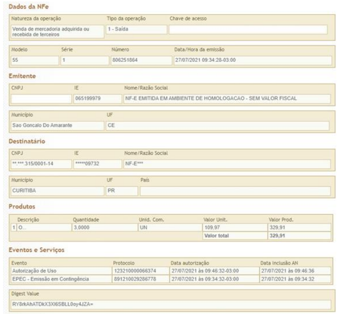
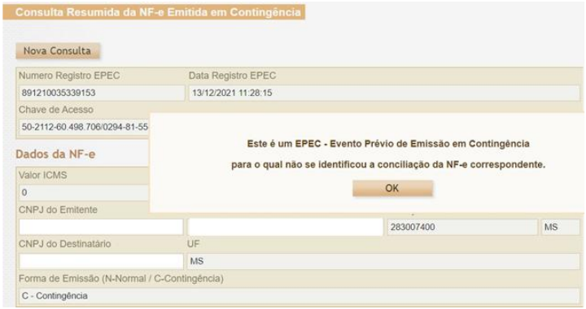
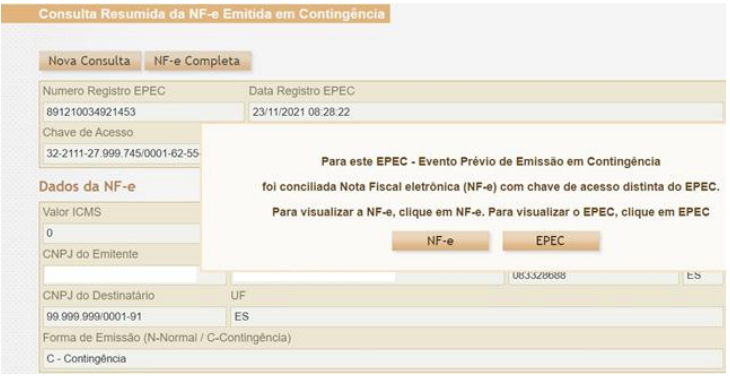

<!-- p.19 -->
# 7. Consulta Pública do EPEC no Portal Nacional da NF-e

**A. Evento EPEC com NF-e conciliada com a mesma chave de acesso**

Caso a NF-e referente ao EPEC tenha sido autorizada com a mesma chave de acesso, a Consulta Pública da NF-e é visualizada normalmente, mostrando também a existência do evento de EPEC.

*Figura 7.A – Consulta pública: EPEC com NF-e conciliada com a mesma chave de acesso*

<!-- p.20 -->**B. Evento EPEC sem a Respectiva NF-e**

Caso exista unicamente o EPEC, a Consulta Pública da NF-e mostra os dados do EPEC, visualizando unicamente a Aba NF-e, com as informações existentes.

*Figura 7.B – Consulta pública: evento EPEC sem a respectiva NF-e*

**C. Evento EPEC com NF-e conciliada com chaves de acesso diferentes**

Caso a NF-e tenha sido autorizada com chave de acesso diferente do EPEC, é fornecida opção de visualizar o EPEC ou a NF-e.

*Figura 7.C – Consulta pública: EPEC com NF-e conciliada com chaves de acesso diferentes*
