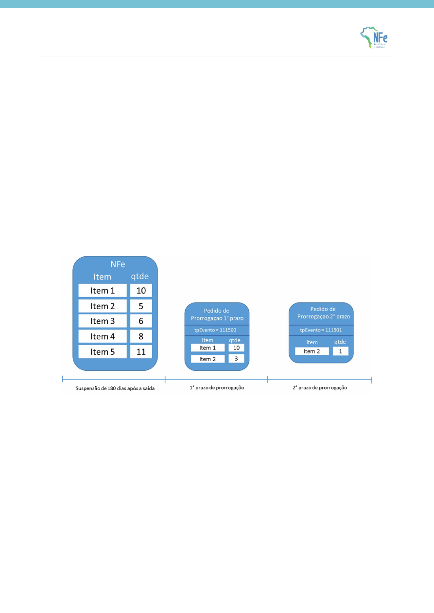
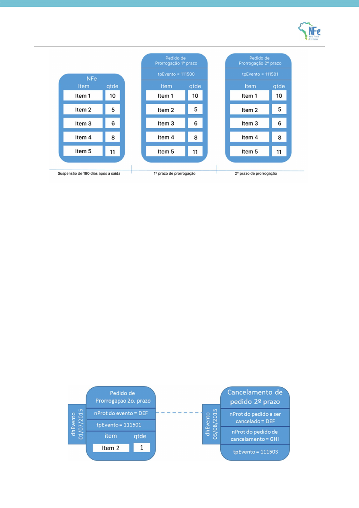

<!-- p.17 -->
# 3.1. Pedido de prorrogação

A saída com a suspensão de ICMS (nos casos previstos em legislação) independe da emissão de eventos na NF-e. Na necessidade de prorrogação deste prazo, o pedido de prorrogação se dá por eventos vinculados à NF-e indicando o item e a quantidade que se pretende prorrogar.

A suspensão do ICMS é prorrogável por mais 180 dias após o primeiro período de prorrogação. Neste caso, a empresa solicita uma nova prorrogação com o evento de 2º prazo de prorrogação. Esse evento poderá ser implementado de duas formas.

A solicitação parcial, em que há a possibilidade de pedido parcial, caso em que o emitente indicará os itens e as quantidades que se pretende prorrogar. Essa é a forma implementada por São Paulo.

A solicitação completa, em que só serão aceitos pedidos totais, ou seja, indicando todos os itens e quantidades da NF-e. Essa é a forma implementada em Minas Gerais.

<!-- p.18 -->

Para a solicitação parcial, no exemplo acima, uma saída de 5 itens teve a suspensão prorrogada por 180 dias para os itens 1 e 2 nas quantidades 10 e 3, respectivamente. Em seguida, a empresa pediu a prorrogação da suspensão novamente para o item 2. Como já havia pedido a prorrogação para 3 unidades do item 2, está limitada a este no valor na 2ª prorrogação. No exemplo acima, pediu para apenas uma 1 unidade.

Já para a solicitação completa, o pedido conforme o exemplo acima seria indeferido. Isso aconteceria porque o pedido não contempla todos os itens e todas as quantidades da NF-e. Essa regra também se aplica para o Pedido de Prorrogação de 2º prazo. O desenho abaixo ilustra um pedido que atende às regras aplicadas para essa opção de implementação.

Como a suspensão pode ser prorrogável por até 2 períodos de 180 dias, há dois pedidos de prorrogação: um para o primeiro período de 180 dias (tpEvento = 111500) e outro para o segundo período de 180 dias (tpEvento = 111501).
