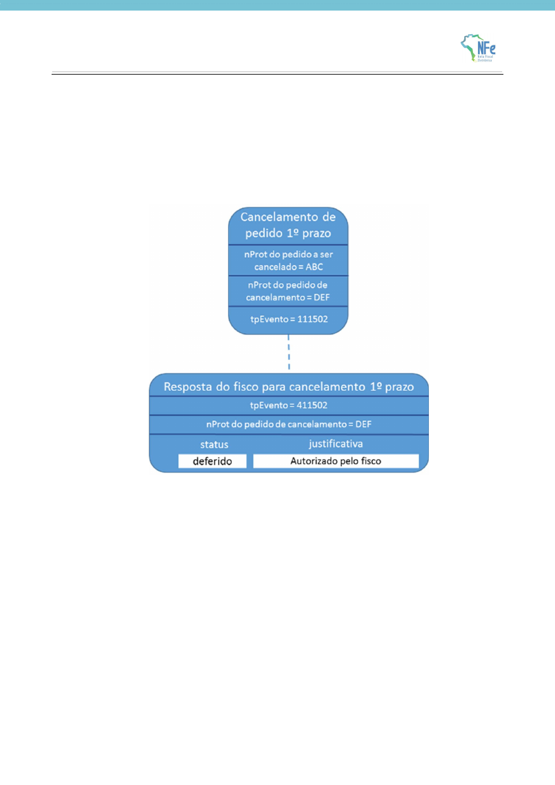

<!-- p.21 -->
# 3.6. Evento de cancelamento de pedido e resposta do fisco

A empresa pode pedir para cancelar um pedido de prorrogação depois da manifestação do fisco (deferindo ou indeferindo o cancelamento).

<!-- p.22 -->

O deferimento de um pedido de cancelamento de um pedido de prorrogação que tenha sido aprovado anteriormente gera um novo evento do fisco revertendo todos os deferimentos. Em situações que estejam fora do controle do fisco, como uma ordem judicial em virtude de um mandado de segurança determinando a reversão de uma resposta do fisco, há a possibilidade de o fisco emitir novo evento revertendo sua posição. Assim, um evento de prorrogação pode ter mais de um evento de resposta do fisco ao longo do tempo. A resposta do fisco que prevalece é sempre a última.

