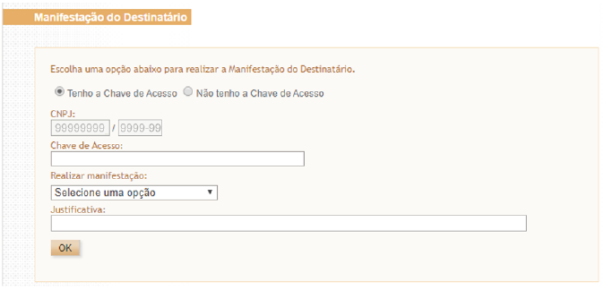
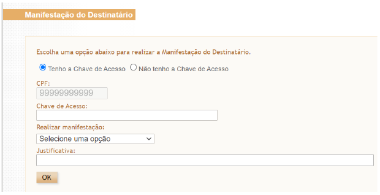
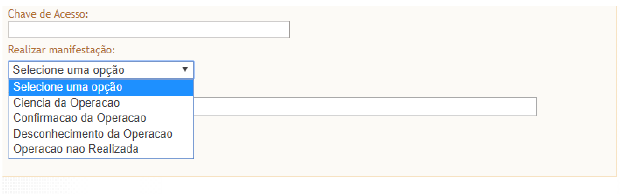

<!-- p.6 -->
# 6.1.1 Manifestação do destinatário com chave de acesso

Nesta opção deve ser informada a chave de acesso e selecionar uma das formas de manifestação: “Ciência da Operação”, “Confirmação da Operação”, “Desconhecimento da Operação” ou “Operação Não Realizada”. O campo “Justificativa” somente será preenchido se selecionada manifestação “Desconhecimento da Operação” ou “Operação Não Realizada”.

O campo “CPF” ou “CNPJ” não é editável, pois corresponde ao CPF ou CNPJ do certificado digital.

<!-- p.7 -->
Nesta opção, é possível realizar a manifestação do destinatário de NF-e destinada a qualquer estabelecimento da pessoa jurídica com um mesmo certificado digital, pois é considerado somente o CNPJ-base (primeiros 8 dígitos do CNPJ) do certificado digital. Ex: certificado digital do CNPJ 99.999.999/0002-99 consegue realizar manifestação de NF-e destinada ao CNPJ 99.999.999/0004-99.

*Figura 1: Tela da manifestação do destinatário com chave de acesso para pessoa jurídica*

*Figura 2: Tela da manifestação do destinatário com chave de acesso para pessoa física*

<!-- p.8 -->

*Figura 3: Opções de manifestação do destinatário com chave de acesso para pessoa física e jurídica*
