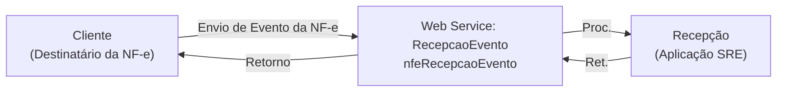

<!-- p.10 -->
# 6.3 Web Service – RecepcaoEvento – Manifestação do Destinatário

**Função:** Serviço destinado à recepção de mensagem de Evento da NF-e.  
**Processo:** síncrono.  
**Método:** nfeRecepcaoEvento

O autor do evento é o destinatário da NF-e. A mensagem XML do evento será assinada com o certificado digital que tenha o CNPJ-Base (8 primeiras posições do CNPJ) ou CPF do Destinatário da NF-e.

Os endereços dos Web Services estão publicados no Portal da NF-e, no ambiente nacional (https://www.nfe.fazenda.gov.br, menu Serviços, Relação de Serviços Web).
