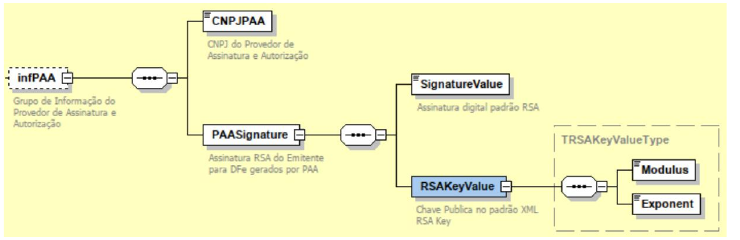

<!-- p.8 -->
# 6.1. Esquema gráfico do leiaute da NF-e contemplando o PAA.

*Figura – Esquema gráfico do leiaute da NF-e contemplando o grupo infPAA (CNPJPAA, PAASignature, SignatureValue e RSAKeyValue).*
