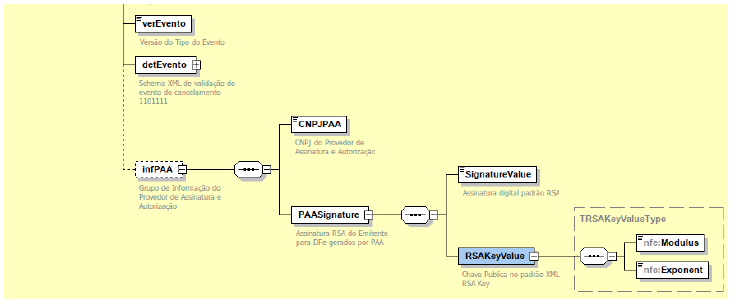

<!-- p.8 -->
# 6.2. Esquema gráfico do leiaute do evento de cancelamento da NF-e contemplando o PAA.

*Figura – Esquema gráfico do leiaute do evento de cancelamento da NF-e contemplando o grupo infPAA.*
