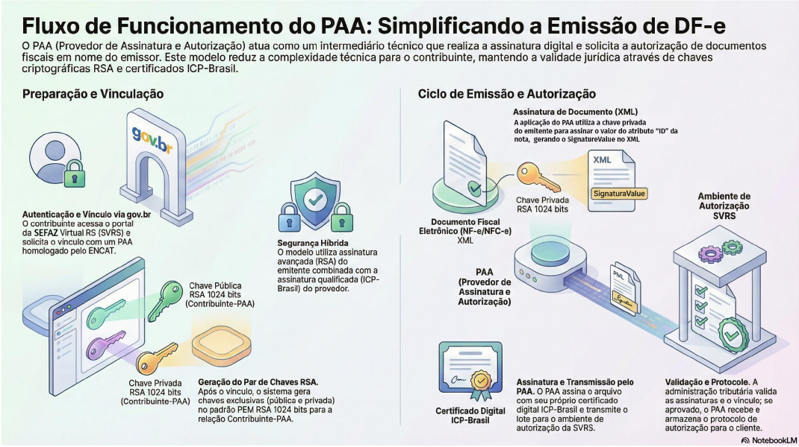

<!-- p.9 -->
# 7. Fluxo simplificado de funcionamento do PAA

*Figura – Fluxo simplificado de funcionamento do PAA: preparação e vinculação (gov.br, par de chaves RSA) e ciclo de emissão e autorização (assinatura do XML, assinatura e transmissão pelo PAA, validação e protocolo pela SVRS).*
