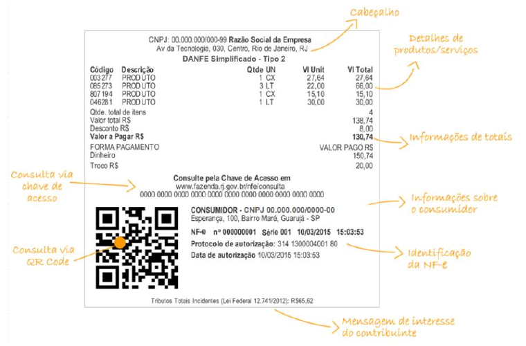
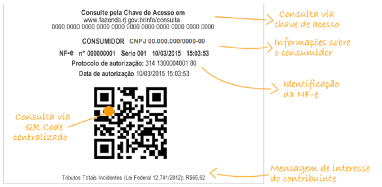
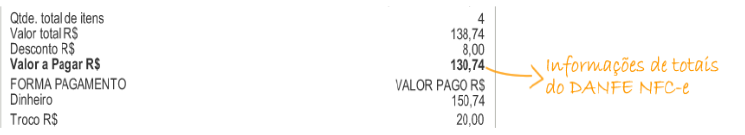
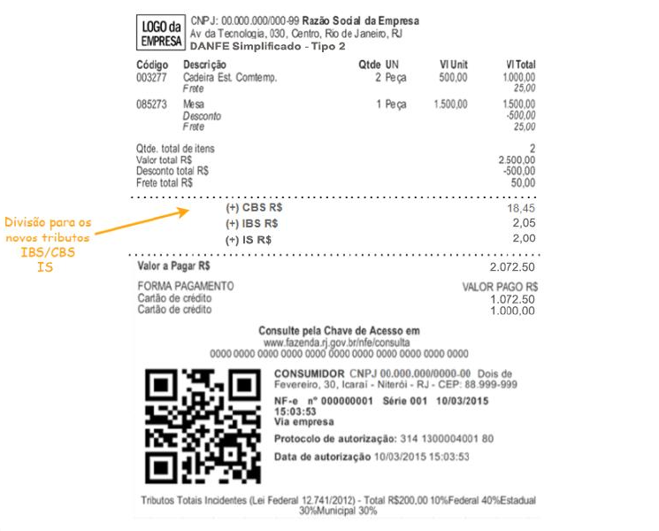
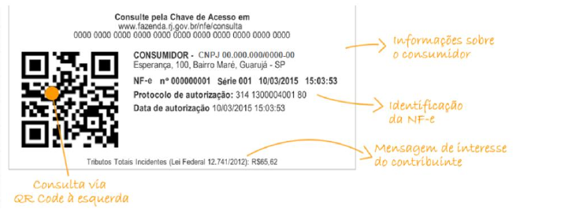
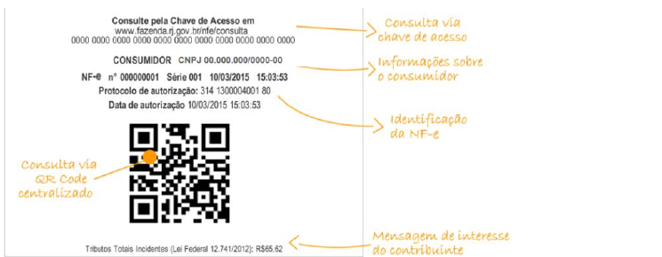
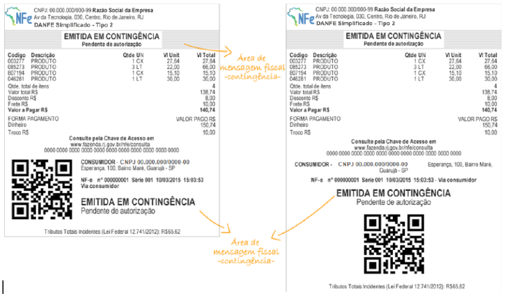

<!-- p.6 -->
# 3.1. Modelo do DANFE Simplificado Tipo 2

Seguem abaixo nas Figuras 1A e 1B as divisões de informações que compõem o DANFE Simplificado Tipo 2.

*Figura 1A: Modelo DANFE Simplificado Tipo 2 - QR Code na lateral*

<!-- p.7 -->

*Figura 1B: QR Code centralizado*

## 3.1.1. Divisão I - Informações do Cabeçalho

O cabeçalho deverá conter as seguintes informações:

- **CNPJ do Emitente** - formatado com a máscara AA.AAA.AAA/AAAA-99 (ID: C02, tag: CNPJ) ou **CPF do Emitente** - formatado com a máscara 999.999.999-99 (ID: C02a, tag: CPF);
- **Razão Social ou Nome do Emitente** (ID: C03, tag: xNome);
- **Endereço Completo do Emitente** sem a indicação do país;
- Texto: “DANFE Simplificado Tipo 2”.

A critério do emissor da NF-e poderá ser incluído, no canto esquerdo desta divisão, o logotipo da empresa ou o logotipo da NF-e.

<!-- p.8 -->

## 3.1.2. Divisão II - Informações de detalhes de produtos/serviços

Figura 2: Detalhes de produtos/serviços

A divisão II (exibida na Figura 2) corresponde ao local onde poderão ser impressas as informações de detalhamento dos produtos/serviços adquiridos. Não são reguladas as posições das informações dos detalhes de produtos/serviços e forma de sua impressão, mas são obrigatórias, no mínimo, as seguintes informações:

- **Código:** código do produto adotado pelo estabelecimento (ID: I02, tag: cProd);
- **Descrição:** descrição do produto (ID: I04, tag: xProd);
- **Qtde:** quantidade de unidades do produto adquiridas pelo consumidor (ID: I10, tag: qCom);
- **Un:** unidade de medida do produto (ID: I09, tag: uCom);
- **Valor unit.:** valor de uma unidade do produto (ID: I10a, tag: vUnCom);
- **Valor total:** valor total do produto (ID: I11, tag: vProd).

As informações de valores devem ter as casas decimais separadas por vírgula e ser utilizado ponto para a indicação de milhar.

## 3.1.3. Divisão III - Informações de Totais do DANFE Simplificado Tipo 2

Figura 3: informações de totais do DANFE Simplificado Tipo 2

Esta divisão define os totais que deverão ser impressos no DANFE Simplificado Tipo 2 de acordo com o detalhamento abaixo:

- **Qtde. Total de Itens:** somatório da quantidade de itens (observação: a quantidade de itens refere-se à quantidade de itens de produtos/serviços distintos na NF-e não guardando qualquer relação com a soma de quantidade de produtos/serviços);
- **Valor Total R$**: somatório dos valores totais dos itens;
- **Acréscimos (frete, seguro e outras despesas) /Desconto R$**: somatório dos valores dos itens dos acréscimos (frete, seguro e outras despesas) e dos descontos (deve ser impressa a linha apenas se existir acréscimo ou desconto) (IDs: W08, W09, W10 e W15, tags: vFrete, vSeg, vDesc e vOutro);
  OBS.: Estas informações, a critério do emitente, podem estar discriminadas por item (IDs: I15, I16, I17 e I17a, tags: vFrete, vSeg, vDesc e vOutro).
- **Valor a Pagar R$:** somatório dos valores totais dos itens somados os acréscimos e subtraído os descontos (deve ser impresso apenas se existir acréscimo ou desconto) (ID: W16, tag: vNF);
- **Forma de Pagamento:** forma na qual o pagamento da NF-e foi efetuado (podem ocorrer mais de uma forma de pagamento, devendo nesse caso ser indicado o montante parcial do pagamento para a respectiva forma. Exemplo: em dinheiro, em cheque, etc. (ID: YA02, tag: tPag);
- **Valor Pago:** valor pago efetivamente em cada forma de pagamento (ID: YA03, tag: vPag);
- **Troco:** valor do troco (ID:YA09, tag: vTroco).

As informações de valores devem ter as casas decimais separadas por vírgula e ser utilizado ponto para a indicação de milhar. A informação do troco é obrigatória.

## 3.1.4. Divisão III-A - Informações dos novos impostos IBS/CBS

Esta divisão define as informações dos novos tributos, quando existirem, previstos na Lei Complementar 214/2025, que deverão ser impressos no DANFE Simplificado Tipo 2 de acordo com o detalhamento abaixo:

<!-- p.10 -->

Figura 4: informações dos novos tributos no DANFE Simplificado Tipo 2

- **(+) CBS R$**: Destaque da CBS;
- **(+) IBS R$**: Destaque do IBS da Unidade Federada e do Município;
- **(+) IS R$**: Destaque do Imposto Seletivo. Apenas se houver imposto seletivo.

## 3.1.5. Divisão IV - Informações da consulta via chave de acesso

Esta divisão contém as informações referentes à consulta NF-e. Deve iniciar com o texto “Consulte pela Chave de Acesso em” seguido do endereço eletrônico para consulta pública da NF-e no Portal da Secretaria da Fazenda da Unidade Federada do contribuinte, e a chave de acesso impressa em 11 blocos de quatro dígitos, com um espaço entre cada bloco.

A URL de consulta da chave de acesso da NF-e deve constar do arquivo XML da NF-e, no campo destinado às Informações Suplementares da Nota Fiscal (tag ZX-03).

<!-- p.11 -->

## 3.1.6. Divisão V - Informações da consulta via QR Code

A divisão V corresponde à área de impressão do QR Code no DANFE Simplificado Tipo 2. A imagem do QR Code poderá ser impressa à esquerda das informações exigidas nas Divisões VI e VII, conforme figura 4, ou centralizada, conforme figura 5, e deve ter tamanho mínimo 25mm x 25mm, sendo 22mm de conteúdo para 3mm de margem segura (quiet zone). Para dimensões superiores a 25mm, considerar a margem segura de 10% da dimensão total.

Figura 5: Layout DANFE Simplificado Tipo 2 com QRCode à esquerda

Figura 6: Layout DANFE Simplificado Tipo 2 com QRCode centralizado

## 3.1.7. Divisão VI - Informações sobre o Consumidor

Nesta Divisão deve ser informada a identificação do adquirente no DANFE Simplificado Tipo 2, à direita ou antes da Divisão V, conforme exemplo nas figuras 4 ou 5. Deverá constar uma das seguintes opções, em caixa alta, conforme o caso: “CONSUMIDOR CNPJ:” e o respectivo CNPJ (ID: E02, tag: CNPJ).

<!-- p.12 -->

Poderão ser incluídos nesta divisão também o nome do adquirente e/ou seu endereço. No caso de emissão de NF-e nas operações não presenciais é obrigatória a impressão do nome do adquirente e do endereço de entrega.

## 3.1.8. Divisão VII - Informações de Identificação da NF-e e do Protocolo de Autorização

As informações da divisão VII deverão ser impressas em uma das formas indicadas nas figuras 4 ou 5, devendo conter:

- Número da NF-e (ID: B08, tag: nNF)
- Série da NF-e (ID: B07, tag: serie)
- Data e Hora de Emissão da NF-e (ID: B09, tag: dhEmi), convertida para o horário local (apesar da data de emissão constar no arquivo XML da NF-e em formato UTC, esta data deverá ser impressa no DANFE NF-e sempre convertida para o horário local)
- O texto “Protocolo de autorização:” seguido do número do protocolo de autorização (ID: PR09, tag: nProt) obtido para NF-e e a data e hora da autorização (ID: PR08, tag: dhRecbto). A data de autorização é fornecida pela SEFAZ no formato UTC e deve ser impressa no DANFE NF-e convertida para o horário local. No caso de emissão em contingência a informação sobre o protocolo de autorização será suprimida.

## 3.1.9. Divisão VIII - Área de Mensagem Fiscal

Esta divisão é reservada para a impressão de mensagens de interesse fiscal que constem do campo informações fiscais do arquivo eletrônico da NF-e (tag: infAdFisco).

Na hipótese de emissão de NF-e em contingência é obrigatório imprimir em destaque o texto em duas linhas: “EMITIDA EM CONTINGÊNCIA Pendente de autorização”. O texto deve ser exibido em dois locais no documento:

- **Abaixo do cabeçalho (divisão I):** centralizado em duas linhas, entre bloco de linhas, conforme imagem a seguir.
- **Abaixo da identificação da NF-e (divisão VII):** em duas linhas, conforme Figura 6, a seguir.

<!-- p.13 -->

Figura 6: DANFE Simplificado Tipo 2 emitido em contingência

Ainda na hipótese de contingência, deverá ser impressa uma segunda via do DANFE NF-e que deverá permanecer à disposição do Fisco no estabelecimento até que tenha sido transmitida e autorizada a respectiva NF-e emitida em contingência.

Para qualquer NF-e emitida em ambiente de homologação é obrigatório imprimir nesta área, de forma centralizada e em caixa alta, o seguinte texto: “EMITIDA EM AMBIENTE DE HOMOLOGAÇÃO - SEM VALOR FISCAL”.

No caso de emissão de NF-e em contingência, a 2ª via do DANFE Simplificado Tipo 2 deverá ser identificada com a impressão ao lado da data e hora da emissão do texto “Via do Estabelecimento”.

## 3.1.10. Divisão IX - Mensagem de Interesse do Contribuinte

Esta divisão corresponde à parte final do DANFE Simplificado Tipo 2 e se refere à área em que poderão ser impressas mensagens de interesse do contribuinte que façam parte do arquivo eletrônico da NF-e no campo informações complementares do contribuinte (ID: Z03, tag: infCpl).

Caso o contribuinte queira imprimir, no mesmo papel do DANFE Simplificado Tipo 2, mensagens institucionais ou outras informações que não estejam no arquivo XML da NF-e, as mesmas deverão ser apresentadas logo após o final do DANFE Simplificado Tipo 2 (imediatamente após a divisão IX de mensagem de interesse do contribuinte).

### 3.1.10.1. Informações exigidas pela Lei Federal nº 12.741/2012

A critério do emissor da NF-e poderão ser impressas na área de mensagem de interesse do contribuinte (divisão IX) as informações exigidas pela Lei Federal nº 12.741, de 10 de dezembro de 2012, que trata da discriminação da carga tributária nos documentos fiscais. No leiaute atual da NF-e e NFC-e existe apenas um campo de valor total de tributos por item de mercadoria (campo 183a - vTotTrib) e um campo de valor total de tributos no documento fiscal (campo 341a - vTotTrib).

Esses campos não são de preenchimento obrigatório, e têm natureza informativa ao consumidor sobre a carga tributária total do produto ou serviço, e portanto, não é possível ser feita qualquer validação com relação à soma de tributos destacados na NF-e ou NFC-e.

Fica facultado ao contribuinte emissor que assim desejar, imprimir também na divisão II do detalhe de produtos/serviços o valor total de carga tributária por item de mercadoria.

Também é importante ressaltar que, alternativamente à impressão de informação no documento fiscal, a lei 12.741/12 possibilita a empresa que detalhe a carga tributária por produto por meio de painel afixado ou meio eletrônico disponível ao consumidor no estabelecimento.
