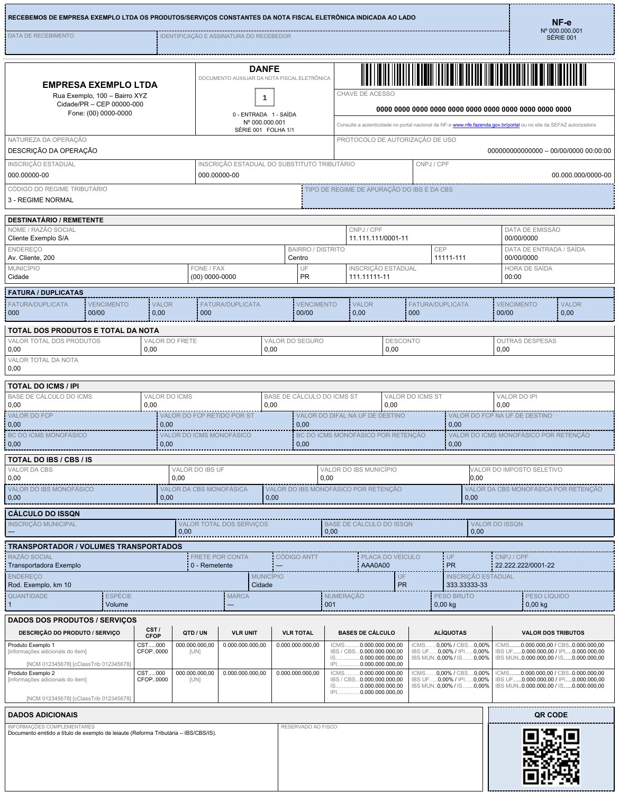
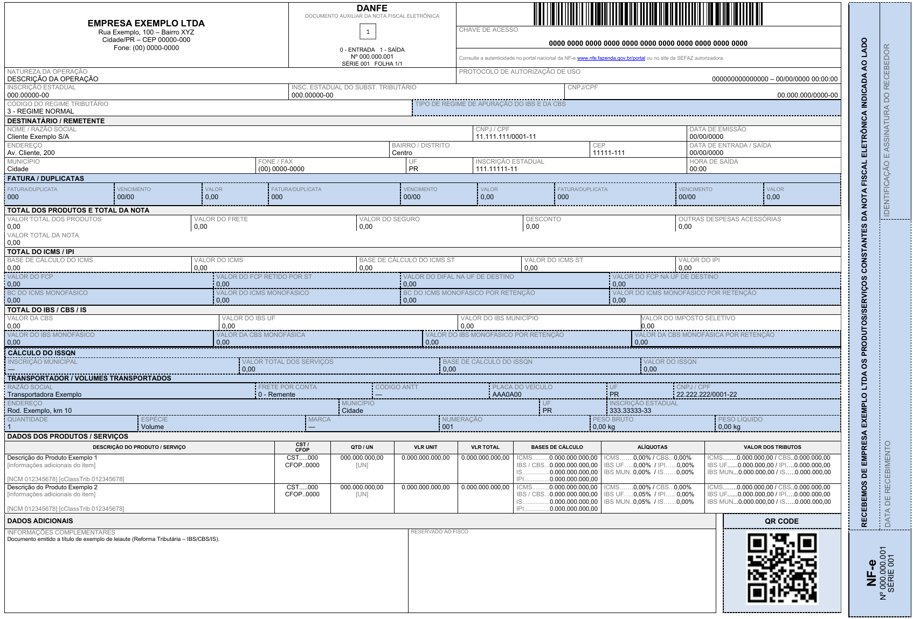

# 5. Modelos de referência

<!-- p.7 -->
Acompanham esta NT dois arquivos com os modelos de leiaute prontos, para uso como referência de implementação:

- DANFE - Modelo55 - Vertical — Leiaute de referência principal
- DANFE - Modelo55 - Horizontal — Leiaute alternativo

Os valores exibidos nos modelos são fictícios e servem apenas para ilustrar a disposição dos campos.

<!-- p.8 -->

*Figura – Leiaute de referência principal (DANFE - Modelo55 - Vertical). Valores fictícios.*

<!-- p.9 -->

*Figura – Leiaute alternativo (DANFE - Modelo55 - Horizontal). Valores fictícios.*
