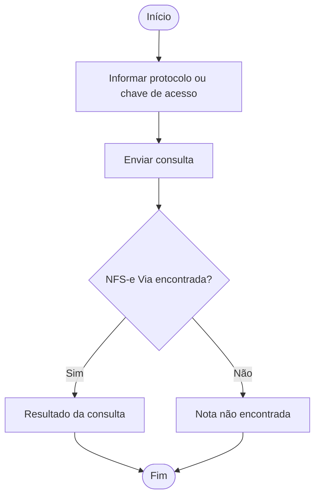

<!-- p.13 -->

# 4.5 Fluxo para homologação – Consultar Resultado do Envio

```mermaid
flowchart TD
    I(["Início"]) --> A["Informar protocolo ou chave de acesso"]
    A --> B["Enviar consulta"]
    B --> C{"NFS-e Via encontrada?"}
    C -- "Sim" --> D["Resultado da consulta"]
    D --> E(["Fim"])
    C -- "Não" --> F["Nota não encontrada"]
    F --> E
```
