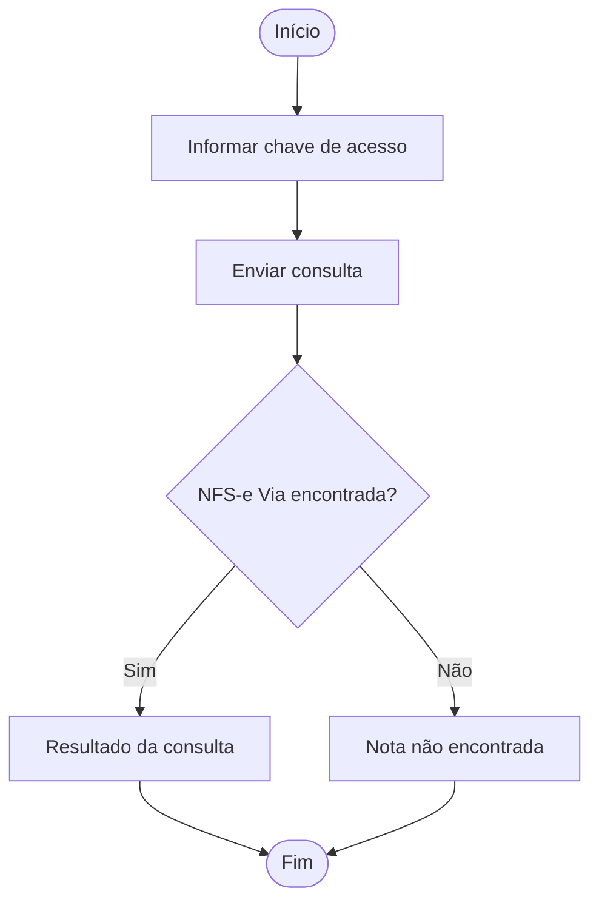

<!-- p.15 -->

# 4.6 Fluxo para homologação – Consultar Histórico NFS-e Via Envio

```mermaid
flowchart TD
    I(["Início"]) --> A["Informar chave de acesso"]
    A --> B["Enviar consulta"]
    B --> C{"NFS-e Via encontrada?"}
    C -- "Sim" --> D["Resultado da consulta"]
    D --> E(["Fim"])
    C -- "Não" --> F["Nota não encontrada"]
    F --> E
```
