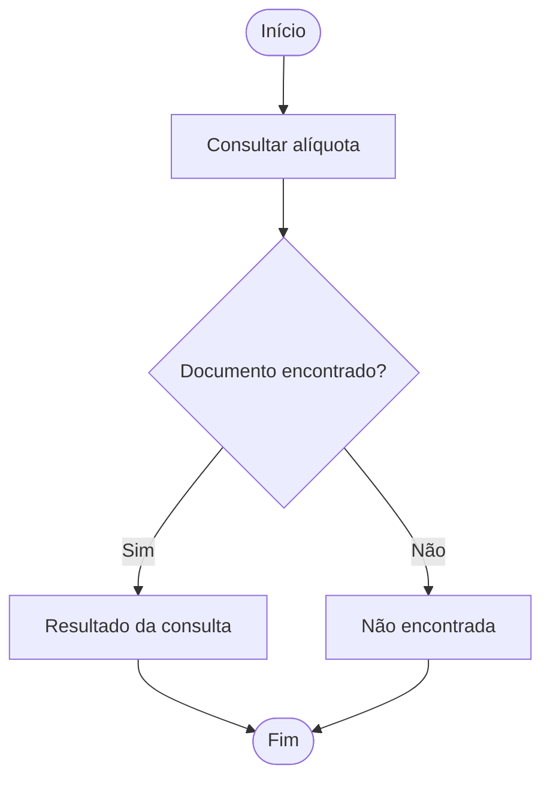

<!-- p.20 -->

# 5.3 Fluxo para homologação – Consultar Alíquota do Município por Trecho

```mermaid
flowchart TD
    I(["Início"]) --> A["Consultar alíquota"]
    A --> B{"Documento encontrado?"}
    B -- "Sim" --> C["Resultado da consulta"]
    C --> D(["Fim"])
    B -- "Não" --> E["Não encontrada"]
    E --> D
```
