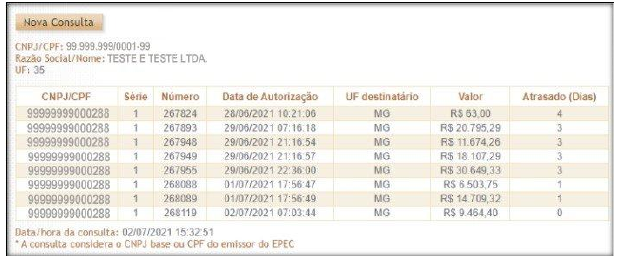

<!-- p.14 -->
# 4. Controle do Ambiente de Contingência do EPEC

As notas fiscais emitidas em contingência, com a autorização do "Evento Prévio de Emissão em Contingência (EPEC)", devem ser transmitidas imediatamente após a cessação dos problemas técnicos que impediam a transmissão da NF-e, observado o prazo limite definido na legislação.

Neste modelo de contingência serão estabelecidos controles para identificar a existência de EPEC sem o envio da NF-e correspondente. Passado o prazo previsto na legislação para o envio da NF-e, será bloqueada a autorização de novos EPEC para o Contribuinte Emitente, sem prejuízo das demais ações relacionadas com a ausência da NF-e para os EPEC pendentes de conciliação.

## 4.1 Controle de EPEC Pendente de Conciliação

Para cada EPEC autorizado, a SEFAZ (e/ou o Ambiente Nacional) deverá manter um controle em banco de dados, contendo, entre outras, as informações de:

- Chave de Acesso da NF-e, com os campos:
  - Modelo do documento fiscal (55=NF-e);
  - UF e CNPJ do Emitente, além da Série e Número da NF-e;
- UF do Destinatário;
- Valor do EPEC;
- Protocolo e Data-Hora da Autorização do EPEC;
- Indicador de Conciliação: 0=Pendente; 1 = EPEC Conciliado;
- Indicador para Liberar a necessidade de Conciliação: 0=Não; 1=Liberada a necessidade de conciliação do EPEC.

Quando o Emitente enviar a NF-e com a mesma Chave de Acesso de um EPEC pendente, o "Indicador de Conciliação" do EPEC deverá ser alterado, eliminando a pendência de conciliação.

## 4.2 Controle do Ambiente de Contingência do EPEC

**A. Bloqueio do Ambiente de Contingência EPEC**

Diariamente será efetuada uma avaliação dos "EPEC Pendente de Conciliação" há mais de 168 horas (7 dias), bloqueando o Ambiente de Contingência do EPEC para o Emitente com pendência. A partir deste momento, o Emitente não conseguirá obter autorização de novas EPEC, enquanto não regularizar a situação dos "EPEC Pendentes de Conciliação".

**B. Desbloqueio do Ambiente de Contingência EPEC**

Deverá ser efetuado o desbloqueio do "Ambiente de contingência EPEC" para um Emitente (CNPJ ou CPF) bloqueado anteriormente, mas que não possua mais "EPEC Pendente de Conciliação".

Outras informações:

- A avaliação do desbloqueio do ambiente EPEC para um determinado Emitente pode ser feita no momento de recepção da NF-e correspondente ao EPEC que originou o bloqueio. Se não restarem outros EPEC pendentes de conciliação após o prazo de 168 horas, o ambiente EPEC pode ser liberado;
- Deverá ser possível desconsiderar a necessidade de conciliação para um determinado EPEC, a partir de comando de liberação pela SEFAZ, efetuado em Extranet disponibilizada pelo <!-- p.15 -->Ambiente Nacional. Esta liberação comandada pode significar o desbloqueio do Ambiente EPEC, caso não existam outros EPEC pendentes de conciliação.

## 4.3 Relação de EPEC Pendente de Conciliação

É responsabilidade da empresa obter a autorização de uso da NF-e com Chave de Acesso idêntica ao EPEC previamente autorizado.

A critério de cada UF poderá ser disponibilizada no Portal da SEFAZ, em área restrita, uma Consulta de EPEC Pendente de Conciliação, onde o operador informa o CNPJ ou CPF do Emitente, obtendo as informações de:

- UF, CNPJ ou CPF consultado e Nome da Empresa;
- Relação dos EPEC Pendente de Conciliação, na ordem de Data de Autorização do EPEC, mostrando também as informações destes EPEC.

No Portal Nacional da NF-e (www.nfe.fazenda.gov.br), existe o serviço "Consultar EPEC pendente de conciliação", o qual exige o uso de certificado digital do emitente (CPF ou CNPJ) do EPEC. Caso o certificado digital pertença a uma pessoa jurídica, este serviço considera o CNPJ-base (8 primeiros dígitos) do certificado digital e exibe na tela o CNPJ 14 dígitos, série, número da NF-e, data de autorização, UF destinatário, valor e dias de atraso na conciliação dos EPECs pendentes .

*Figura 4.3 – Consulta de EPEC pendente de conciliação*
