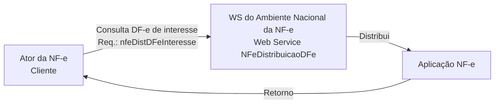

# NT 2014.002

**Web Service de Distribuição de DF-e de Interesse dos Atores da NF-e (PF ou PJ)**  
**Versão 1.40 – julho de 2026**

<!-- p.3 -->
## 1. Histórico de Alterações / Cronograma

| Versão | Histórico de atualizações | Implantação teste | Implantação produção |
|---|---|---|---|
| 1.00 | Versão inicial desenvolvida pelo Serpro | | 01/2014 |
| 1.01 | Acertos sugeridos pelo grupo XML | | 08/2014 |
| 1.02 | Inclusão para distribuição dos Eventos: Registro de Passagem, Pedido de Prorrogação/Cancelamento do prazo de suspensão do ICMS nas remessas enviadas para industrialização e os demais Eventos de Resposta do Fisco; Possibilidade de consulta ao Web Service para uma chave de acesso de NF-e informada; Distribuição do Evento de Cancelamento para o destinatário independente de sua manifestação | | 10/2016 |
| 1.02b | Inclusão da distribuição dos Eventos de Averbação | | 05/2017 |
| 1.02c | Inclusão da distribuição do Evento de Comprovante de Entrega propagado do CT-e | 16/09/2020 | 30/09/2020 |
| 1.02d | Melhorias na documentação: – Esclarecer melhor o que é disponibilizado nos 3 tipos de consultas: chave de acesso (consChNFe), Distribuição NSU (distNSU) e NSU Pontual (consNSU); – Detalhar as situações que se enquadram como “Uso indevido”; – Retirar remissões desatualizadas; | 03/2021 | 03/2021 |
| 1.10 | Informa alteração na geração de NSU para otimizar a distribuição de NF-e e eventos. Atualiza a tabela de distribuição incluindo o evento de comprovante de entrega da NF-e previsto na NT 2021.001, que já está sendo distribuído em homologação desde 01/06/2021 e em produção desde 22/06/2021. | 01/11/2021 | 08/11/2021 |
| 1.11 | Atualiza datas de homologação e produção da alteração na geração de NSU para otimizar a distribuição de NF-e e eventos. Melhorias na documentação. | 03/11/2021 | 10/11/2021 |
| 1.12 | Atualiza regras de classificação como Uso Indevido (Divulgação antecipada das novas regras em 04/03/22 – no “Informes” – Portal da NF-e – www.fazenda.gov.br. | 09/03/2022 | 10/03/2022 |
| 1.13 | Disponibilização de eventos do Fisco para emitente e destinatário iguais | 09/12/2021 | 09/12/2021 |
| 1.14 | Retorno do ultNSU na rejeição 656 com consulta “distNSU” | 24/03/2022 | 24/03/2022 |
| 1.15 | Retorno de NSU tornado facultativo | 24/05/2022 | 21/06/2022 |
| 1.20 | Inclusão do evento “Ator Interessado” | 20/05/2024 | 03/06/2024 |
| 1.21 | Correção na documentação do evento “Ator Interessado” | 20/05/2024 | 03/06/2024 |
| 1.30 | Inclusão dos eventos “Insucesso da Entrega na NF-e” e “Insucesso na Entrega do CT-e propagado para NF-e” | 30/09/2024 | 30/09/2024 |
| 1.40 | Alteração de “N” para “C” nos campos “CNPJ” visando adequar ao CNPJ alfanumérico. | 08/07/2026 | 08/07/2026 |

<!-- p.4 -->
# 2. Resumo

Um dos grandes desafios do projeto Nota Fiscal Eletrônica é prover para os atores envolvidos nos processos da NF-e informações de seu interesse de forma eficiente e confiável.

Esta nota técnica tem como objetivo regulamentar e informar sobre o uso do *Web Service* denominado NFeDistribuicaoDFe, que disponibiliza para os atores da NF-e informações e documentos fiscais eletrônicos de seu interesse. A distribuição é realizada, conforme outras regras informadas neste documento, para emitentes, destinatários, transportadores e terceiros informados no conteúdo da NF-e, respectivamente no grupo do Emitente (tag: emit, id: C01), no grupo do Destinatário (tag: dest, id: E01), no grupo do Transportador (tag: transporta, id: X03) e no grupo de pessoas físicas autorizadas a acessar o XML (tag: autXML, id: GA01).

# 3. Web Service – NFeDistribuicaoDFe

**Distribui documentos e informações de interesse do ator da NF-e**

*Figura – Fluxo do Web Service NFeDistribuicaoDFe. O ator envia uma consulta de DF-e de interesse ao serviço e recebe o retorno da aplicação NF-e.*

**Função:** Serviço destinado à distribuição de informações resumidas e documentos fiscais eletrônicos de interesse de um ator, seja este uma pessoa física ou jurídica.

**Processo:** síncrono

**Método:** nfeDistDFeInteresse

**Pacote de liberação de Schemas da NT:** PL_NFeDistDFe_102

Este serviço permite que um ator da NF-e tenha acesso aos documentos fiscais eletrônicos (DF-e) e informações resumidas que não tenham sido gerados por ele e que sejam de seu interesse. Pode ser consumido por qualquer ator de NF-e, Pessoa Jurídica ou Pessoa Física, que possua um certificado digital de PJ ou PF.

No caso de Pessoa Jurídica, a empresa será autenticada pelo CNPJ base (8 primeiros dígitos) e poderá realizar a consulta para qualquer CNPJ da empresa (14 dígitos), desde que o CNPJ base consultado seja o mesmo do certificado digital.

Os documentos fiscais eletrônicos e informações resumidas estarão disponíveis para distribuição por até 90 dias após sua recepção pelo Ambiente Nacional da NF-e.

Caso a consulta seja realizada pelo destinatário, o Ambiente Nacional irá verificar a existência de sua manifestação (“Ciência da Operação”, “Operação não Realizada” ou “Confirmação de Operação”). Em caso da existência da manifestação do destinatário, a NF-e será retornada para o destinatário. Caso contrário, será retornado apenas o resumo da NF-e. Com o resumo, o destinatário terá as informações necessárias para realizar a manifestação.

<!-- p.5 -->
Para transportador e terceiros, a NF-e estará disponível integralmente na consulta.

A distribuição ocorrerá para os atores que desempenham papéis de emitente, destinatário, transportador e terceiros (informado na tag `autXML`), e englobará os documentos que estiverem com “SIM” na linha correspondente, conforme tabela abaixo:

| Documentos | Emitente | Destinatário[^1] | Transportador[^2] | Terceiros[^3] | CNPJ de transportador informado em evento “Ator Interessado” |
|---|---:|---:|---:|---:|---:|
| NF-e | Não | Sim | Sim | Sim | Sim |
| Evento de Cancelamento | Não | Sim | Sim | Sim | Sim |
| Evento de Carta de Correção | Não | Sim | Sim | Sim | Sim |
| Eventos de Manifestação do Destinatário | Sim | Não | Não | Sim | Não |
| Eventos da Suframa (Vistoria/Internalização) | Sim | Sim | Não | Sim | Não |
| EPEC | Não | Sim | Sim | Não | Sim |
| Eventos de Pedido de Prorrogação de Prazo[^4] | Não | Sim | Não | Não | Não |
| Eventos do Fisco em Resposta ao Pedido de Prorrogação[^5] | Sim | Sim | Não | Não | Não |
| Evento de Averbação[^6] | Sim | Sim | Sim | Sim | Sim |
| Resumo de NF-e | Não | Sim | Não | Não | Não |
| Resumo de Eventos CT-e Autorizado/Cancelado | Sim | Sim | Sim | Sim | Sim |
| Resumo de Eventos MDF-e Autorizado/Cancelado | Sim | Sim | Sim | Sim | Sim |
| Resumo de Eventos de Registro de Passagem | Sim | Sim | Sim | Sim | Sim |
| Evento de Comprovante de Entrega Autorizado/Cancelado propagado do CT-e[^7] | Sim | Sim | Sim | Sim | Sim |
| Evento de Comprovante de entrega na NF-e e Cancelamento | Não | Sim | Sim | Sim | Não |
| Evento de Insucesso da Entrega Autorizado/Cancelado propagado do CT-e | Sim | Sim | Sim | Sim | Sim |
| Evento de Insucesso da entrega na NF-e e Cancelamento | Não | Sim | Sim | Sim | Não |

[^1]: Os documentos fiscais e resumos de eventos estarão disponíveis somente se o destinatário se manifestar dando “Ciência da Operação”, “Operação não Realizada” ou “Confirmação de Operação” para a NF-e, exceto para o Evento de Cancelamento, que será disponibilizado mesmo sem a manifestação do destinatário. Antes da manifestação ficará disponível para o destinatário somente a estrutura XML de “Resumo de NF-e” e o cancelamento de NF-e.
[^2]: A NF-e estará disponível somente para o transportador identificado no grupo X03 ou que tiver sido informado no evento “Ator Interessado na NF-e” (cod. 110150).
[^3]: A NF-e estará disponível para terceiros somente cujo CNPJ ou CPF estiver informado na tag `autXML`.
[^4]: Eventos de Pedido de Prorrogação de Prazo da NT 2015.001: EPP1 e EPP2 (Evento Pedido de Prorrogação 1º e 2º Prazo), ECPP1 e ECPP2 (Evento Cancelamento Pedido de Prorrogação 1º e 2º Prazo).
[^5]: Eventos do Fisco em Resposta ao Pedido de Prorrogação de Prazo da NT 2015.001: EFPP1 e EFPP2 (Evento Fisco Resposta ao Pedido de Prorrogação 1º e 2º Prazo), EFCPP1 e EFCPP2 (Evento Fisco Resposta ao Cancelamento de Prorrogação 1º e 2º Prazo).
[^6]: Os Eventos de Averbação serão distribuídos a partir da implantação do BT 2017/001 v1.0.
[^7]: Os eventos de comprovante de entrega propagados do CT-e serão distribuídos a partir da implantação do BT 2019.001 v.1.10.

**OBS:** A partir da versão 1.13 desta Nota Técnica, os eventos gerados pelo Fisco, que forem passíveis de distribuição conforme a tabela acima, serão distribuídos ao emitente independente de manifestação do destinatário, ainda que emitente e destinatário sejam iguais.
