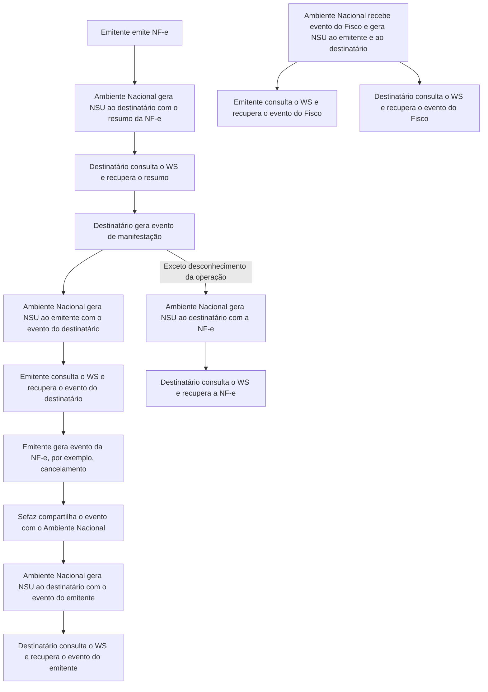

<!-- p.6 -->
# 3.1. Leiaute Mensagem de Entrada

**Entrada:** Estrutura XML com o pedido de distribuição de DF-e de interesse do ator  
**Schema XML:** `distDFeInt_v9.99.xsd`

| # | Campo | Ele | Pai | Tipo | Ocor. | Tam. | Descrição/Observação |
|---|---|---|---|---|---|---|---|
| **A01** | **distDFeInt** | **Raiz** | **-** | **-** | **-** | **-** | **TAG raiz** |
| A02 | versao | A | A01 | N | 1-1 | 2v2 | Versão do leiaute |
| A03 | tpAmb | E | A01 | N | 1-1 | 1 | Identificação do Ambiente: 1=Produção /2=Homologação |
| A04 | cUFAutor | E | A01 | N | 0-1 | 2 | Código da UF do Autor |
| A05 | CNPJ | CE | A01 | ~~N~~ C | 1-1 | 14 | CNPJ do interessado no DF-e |
| A06 | CPF | CE | A01 | N | 1-1 | 11 | CPF do interessado no DF-e |
| **A07** | **distNSU** | **CG** | **A01** | **-** | **1-1** | **-** | **Grupo para distribuir DF-e de interesse** |
| A08 | ultNSU | E | A07 | N | 1-1 | 1-15 | Último NSU recebido pelo ator. Caso seja informado com zero, ou com um NSU muito antigo, a consulta retornará unicamente as informações resumidas e documentos fiscais eletrônicos que tenham sido recepcionados pelo Ambiente Nacional no máximo nos últimos 3 meses. |
| **A09** | **consNSU** | **CG** | **A01** | **-** | **1-1** | **-** | **Grupo para consultar um DF-e a partir de um NSU específico** |
| A10 | NSU | E | A09 | N | 1-1 | 1-15 | Número Sequencial Único. Geralmente esta consulta será utilizada quando identificado pelo interessado um NSU faltante. O Web Service retornará o documento ou informará que o NSU não existe no Ambiente Nacional. Assim, esta consulta fechará a lacuna do NSU identificado como faltante. |
| **A11** | **consChNFe** | **CG** | **A01** | **-** | **1-1** | **-** | **Grupo para consultar uma NF-e pela chave de acesso** |
| A12 | chNFe | E | A11 | N | 1-1 | 44 | Chave de acesso específica. |

> **Descontinuado:** o tipo `N` foi substituído por `C` no campo CNPJ na versão 1.40 desta Nota Técnica, para adequação ao CNPJ alfanumérico.

## 3.2. Leiaute Mensagem de Retorno

**Retorno:** Estrutura XML com os documentos de interesse do ator (qtde máxima=50).  
**Schema XML:** `retDistDFeInt _v9.99.xsd`

| # | Campo | Ele | Pai | Tipo | Ocor. | Tam. | Descrição/Observação |
|---|---|---|---|---|---|---|---|
| **B01** | **retDistDFeInt** | **Raiz** | **-** | **-** | **-** | **-** | **TAG raiz da Resposta** |
| B02 | versao | A | B01 | N | 1-1 | 2v2 | Versão do leiaute |
| B03 | tpAmb | E | B01 | N | 1-1 | 1 | Identificação do Ambiente: 1=Produção /2=Homologação |
| B04 | verAplic | E | B01 | C | 1-1 | 1-20 | Versão do aplicativo que processou a consulta |
| B05 | cStat | E | B01 | N | 1-1 | 3 | Código do status da resposta (vide item 5) |
| B06 | xMotivo | E | B01 | C | 1-1 | 1-255 | Descrição literal do status da resposta |
| B07 | dhResp | E | B01 | D | 1-1 | | Data e hora da mensagem de Resposta. Formato: “AAAA-MM-DDThh:mm:ssTZD” (UTC - Universal Coordinated |
| B08 | ultNSU | E | B01 | N | 0-1 | 1-15 | Último NSU pesquisado no Ambiente Nacional. Se for o caso, o solicitante pode continuar a consulta a partir deste NSU para obter novos resultados. |
| B09 | maxNSU | E | B01 | N | 0-1 | 1-15 | Maior NSU existente no Ambiente Nacional para o CNPJ/CPF informado |
| **B10** | **loteDistDFeInt** | **G** | **B01** | **-** | **0-1** | **-** | **Conjunto de informações resumidas e documentos fiscais eletrônicos de interesse da pessoa física ou empresa.** |
| B11 | docZip | E | B10 | B64 | 1-50 | | Informação resumida ou documento fiscal eletrônico de interesse da ou empresa. O conteúdo desta tag estará compactado no padrão gZip. O tipo do campo é base64Binary. |
| B12 | NSU | A | B11 | N | 0-1 | 1-15 | NSU do documento fiscal |
| B13 | schema | A | B11 | C | 1-1 | - | Identificação do Schema XML que será utilizado para validar o XML existente no campo seguinte. Vai identificar o tipo do documento e sua versão. Exemplos: resNFe_v1.00.xsd; procNFe_v3.10.xsd, resEvento_1.00.xsd - procEventoNFe_v1.00.xsd |

<!-- REVISAR p.6: B07 termina em “UTC - Universal Coordinated” sem completar a expressão; B11 traz “da ou empresa”, conforme impresso. -->

## 3.3. Mensagem de Retorno Compactada

O tamanho médio da NF-e é de aproximadamente 10 KB (dependendo da quantidade de itens), necessitando de um dimensionamento correto da rede interna e do canal de Internet das empresas e do Ambiente Nacional.

<!-- p.7 -->
Para minimizar necessidades de infraestrutura de rede, cada documento contido na mensagem de retorno da solicitação será compactado (tag: `docZip`). Estima-se que a compactação reduzirá o tamanho da mensagem de retorno em aproximadamente 60%.

A aplicação do Ambiente Nacional irá compactar individualmente cada documento da mensagem de retorno e a aplicação cliente deverá descompactá-lo e seguir o procedimento normal do tratamento do documento descompactado.

O padrão de compactação adotado para o projeto será o Gzip (GNU zip) que é implementado nas plataformas Java e .NET.

## 3.4. Descrição do Processo de Distribuição de DF-e de Interesse

Este serviço pode ser consumido por atores que desempenham papel na NF-e de emitente, destinatário, transportador ou terceiro (campo `autXML`), Pessoa Física ou Jurídica, que possua um certificado digital de PF com seu CPF ou PJ com seu CNPJ.

O Ambiente Nacional gera um número sequencial único (NSU) para cada interessado nos documentos fiscais.

A geração de NSU, a partir da versão 1.10 desta NT, irá considerar somente os usuários do serviço nos últimos 60 dias. É importante ressaltar que:

a) para os usuários do serviço dos últimos 60 dias, a geração de NSU continuará normalmente;  
b) no caso de novos usuários desse serviço (`distNSU`), a geração de NSU ocorrerá a partir do primeiro acesso. Não haverá geração de NSU retroativo;  
c) qualquer usuário que deixar de utilizar o serviço (`distNSU`) por mais de 60 dias, terá a geração de NSU interrompida e retomada a partir da próxima consulta com este método. Não haverá geração de NSU retroativo ao período de interrupção.

**Obs1:** para as hipóteses “b” e “c” acima, o primeiro acesso retornará “cStat=137-Nenhum documento localizado”. Mas, nas consultas subseqüentes após aguardar o prazo de 1h para cumprir as regras do uso indevido (item 3.11.4), considerando que se passou a gerar NSU, podem retornar documentos.

**Obs2:** A verificação da continuidade de utilização do serviço (`distNSU`) dar-se-á pelo CPF ou CNPJ-base constante na requisição XML.

Antes de gerar NSU para o transportador e para o CNPJ informado no campo `autXML`, é verificado se esses CNPJs também são destinatários na mesma NF-e. Se sim, não é gerado o NSU, até que o destinatário tenha realizado a manifestação.

Os documentos recuperados deverão conter uma sequência de numeração sem intervalos em sua base de dados.

### 3.4.1. Geração do pedido de distribuição

O XML do pedido de distribuição suporta três tipos de consultas que são definidas de acordo com a tag informada no XML. As tags são `distNSU`, `consNSU` e `consChNFe`.

**a) `distNSU` – Distribuição de Conjunto de DF-e a Partir do NSU Informado**

A aplicação cliente do WS deve informar o último número sequencial único (`ultNSU`) que possui e o Ambiente Nacional deve fornecer todos os documentos (NF-e e eventos) disponíveis para o interessado a partir do NSU informado.

Caso o NSU informado seja menor que o primeiro NSU disponível para distribuição, a aplicação do Ambiente Nacional fornecerá os documentos fiscais do NSU mais antigo cujas NF-es e seus eventos tenham sido autorizados há menos de 90 dias.

<!-- p.8 -->
**b) `consNSU` – Consulta DF-e Vinculado ao NSU Informado**

Este processo de consulta DF-e a partir de um NSU permite que o interessado nos documentos fiscais consulte de maneira pontual um NSU que foi identificado como faltante em sua base de dados.

A aplicação cliente do WS deve informar o número sequencial único (NSU) identificado como faltante em sua base de dados e o Ambiente Nacional deve fornecer um único documento fiscal (NF-e ou evento) referente ao NSU informado.

**c) `consChNFe` – Consulta de NF-e por Chave de Acesso Informada**

Este processo de consulta a partir de uma chave de acesso permite que o interessado na NF-e consulte de maneira pontual uma chave de acesso e obtenha o documento relativo à esta chave.

A aplicação cliente do WS deve informar uma chave de acesso válida para recuperar a NF-e; o Ambiente Nacional deve retornar somente a NF-e (não retorna evento) referente à chave de acesso informada.

### 3.4.2. CNPJ ou CPF do Interessado no DF-e

É preciso informar o CPF da pessoa física ou CNPJ da empresa para recuperação de DF-e de seu interesse.

Para as empresas, este campo possibilita a recuperação dos DF-e de qualquer um de seus estabelecimentos com a utilização de um único certificado digital.

### 3.4.3. Envio das Informações

O pedido de distribuição será enviado por Web Service, sendo necessário o uso de um certificado digital de PJ ou PF válido.

O WS do Ambiente Nacional é acionado pela aplicação cliente do interessado que deve enviar uma mensagem que atenda os padrões estabelecidos neste manual.

## 3.5. Processamento da Requisição de Distribuição de Conjunto de DF-e a partir do NSU Informado (tag: `distNSU`)

O *Web Service* deverá gerar lotes com até 50 documentos ao interessado com informações resumidas ou documentos fiscais eletrônicos que tenham o número sequencial único (NSU) superior ao NSU informado.

Caso o NSU informado seja menor que o primeiro NSU disponível para distribuição, a aplicação do Ambiente Nacional fornecerá os documentos fiscais do NSU mais antigo cujas NF-es e seus eventos tenham sido autorizados há menos de 90 dias.

A criação do lote de documentos deverá observar as seguintes regras:

- Ordem crescente de NSU.
- O lote poderá conter qualquer tipo de documento válido e seu respectivo NSU.
- Quantidade máxima de documentos no lote: 50 documentos.

Os documentos (NF-e e eventos) são disponibilizados de acordo com o papel do interessado como ator da NF-e, conforme descrito na tabela do item 3.

Assim como nas demais consultas disponibilizadas pelo Web Service NFeDistribuicaoDFe, a consulta por NSU estará disponível para documentos recebidos pelo Ambiente Nacional nos últimos 90 dias. Após este período não será possível recuperar a NF-e.

<!-- p.9 -->
Importante ressaltar que o processo de recepção e sincronização não será realizado em ordem cronológica de emissão ou autorização de uso, uma vez que a geração do NSU dos documentos será organizada por ordem cronológica de recepção das NF-es e seus eventos pelo Ambiente Nacional.

Não existe necessidade de o Ambiente Nacional estar sincronizado em tempo real com todos os documentos fiscais autorizados. Como a geração do NSU será organizada por ordem de inserção de documentos, a empresa ou pessoa física conseguirá recuperar todos os documentos de seu interesse tão logo estes sejam recebidos pelo Ambiente Nacional da NF-e.

É conveniente manter um controle do primeiro NSU válido para consulta.

A resposta do WS do Ambiente Nacional poderá ser:

- **Rejeição** – com a devolução da mensagem com o motivo da falha informado no cStat;
- **Nenhum documento localizado** – não existe documentos fiscais para o CNPJ/CPF informado – cStat=”137-Nenhum documento localizado”;
- **Documento localizado** – com a devolução dos documentos fiscais encontrados – cStat=”138-Documento(s) localizado(s)”.

A empresa deverá aguardar um tempo mínimo de uma hora para efetuar uma nova solicitação de distribuição caso receba o retorno cStat=“137-Nenhum documento localizado”, indicação que não existem mais documentos a serem pesquisados na base de dados do Ambiente Nacional. Se o NSU informado (tag: `ultNSU`) for igual ao maior NSU do Ambiente Nacional (tag: `maxNSU`), então não existem mais documentos a serem pesquisados no momento.

## 3.6. Processamento da Requisição de Consulta DF-e Vinculado ao NSU Informado (tag: `consNSU`)

Considerando que o Ambiente Nacional gera NSU sem lacunas, o processo de distribuição de conjunto de DF-e a partir do NSU informado (tag: `distNSU`) disponibiliza para o interessado uma sequência de numeração ordenada de forma ascendente. A identificação de alguma lacuna na base de dados do interessado indica que houve alguma falha no processo de distribuição dos documentos.

Neste caso, o interessado deve consultar pontualmente os NSU identificados como faltantes em sua base de dados através do método nfeDistDFeInteresse do Web Service NFeDistribuicaoDFe, informando o NSU desejado no conteúdo da tag `consNSU` no XML de requisição.

Neste método, o Ambiente Nacional deve fornecer um único documento fiscal (NF-e ou evento) referente ao NSU informado.

Assim como nas demais consultas disponibilizadas pelo Web Service NFeDistribuicaoDFe, a consulta por um NSU específico estará disponível para documentos recebidos pelo Ambiente Nacional nos últimos 90 dias. Após este período não será possível recuperar a NF-e.

A resposta do WS poderá ser:

- **Rejeição** – com a devolução da mensagem com o motivo da falha informado no cStat;
- **Nenhum documento localizado** – indicando que o Ambiente Nacional não gerou o NSU e o interessado deve desconsiderá-lo – cStat=”137-Nenhum documento localizado”;
- **Documento localizado** – com a devolução do documento fiscal encontrado – cStat=”138-Documento localizado”.

## 3.7. Processamento da Requisição de Consulta de NF-e por Chave de Acesso Informada (tag: `consChNFe`)

O processo de consulta por chave de acesso (tag: `chNFe`) permite ao interessado consultar pontualmente uma NF-e pela chave de acesso. A chave de acesso informada deve ser válida, existir no Ambiente Nacional e estar vinculada ao interessado como destinatário, transportador ou terceiro.

<!-- p.10 -->
Nesta consulta, o Ambiente Nacional deve retornar somente a NF-e (não retorna qualquer evento) referente à chave de acesso informada.

A partir da versão 1.15 desta Nota Técnica, em que o retorno de NSU pelo Web Service passou a ser facultativo, a consulta por chave de acesso (tag: `consChNFe`) deixa de necessitar de prévia geração de NSU pelo Ambiente Nacional para o documento fiscal consultado.

Assim como nas demais consultas disponibilizadas pelo Web Service NFeDistribuicaoDFe, a consulta por chave de acesso estará disponível para documentos recebidos pelo Ambiente Nacional nos últimos 90 dias. Após este período não será possível recuperar a NF-e.

A resposta do WS poderá ser:

- **Rejeição** – com a devolução da mensagem com o motivo da falha informado no cStat;
- **Nenhum documento localizado** – indicando que o Ambiente Nacional não possui a NF-e consultada ou não foi gerado NSU – cStat = ”137-Nenhum documento localizado”;
- **Documento localizado** – com a devolução do documento fiscal encontrado – cStat= ”138-Documento localizado”.

## 3.8. Validação do Certificado de Transmissão

**Validação do Certificado Digital do Transmissor (protocolo SSL)**

| # | Regra de Validação | Crítica | Msg | Efeito |
|---|---|---|---|---|
| A01 | Certificado de Transmissor Inválido: Certificado de Transmissor inexistente na mensagem – Versão difere "3" – Se informado o Basic Constraint deve ser true (não pode ser Certificado de AC) – KeyUsage não define "Autenticação Cliente" | Obrig. | 280 | Rej. |
| A02 | Validade do Certificado (data início e data fim) | Obrig. | 281 | Rej. |
| A03 | Verifica a Cadeia de Certificação: – Certificado da AC emissora não cadastrado no Ambiente Nacional – Certificado de AC revogado – Certificado não assinado pela AC emissora do Certificado | Obrig. | 283 | Rej. |
| A04 | LCR do Certificado de Transmissor: – Falta o endereço da LCR (CRL DistributionPoint) – LCR indisponível – LCR inválida | Obrig. | 286 | Rej. |
| A05 | Certificado do Transmissor revogado | Obrig. | 284 | Rej. |
| A06 | Certificado Raiz difere da "ICP-Brasil" | Obrig. | 285 | Rej. |
| A07 | Falta a extensão de CNPJ (OtherName - OID=2.16.76.1.3.3) ou a extensão de CPF (OtherName - OID=2.16.76.1.3.1) no Certificado | Obrig. | 473 | Rej. |

As validações de A01, A02, A03, A04 e A05 são realizadas pelo protocolo SSL e não precisam ser implementadas. A validação A06 também pode ser realizada pelo protocolo SSL, mas pode falhar se existirem outros certificados digitais de Autoridade Certificadora Raiz que não sejam “ICP-Brasil” no repositório de certificados digitais do servidor de Web Service do Órgão da consulta.

## 3.9. Validação Inicial da Mensagem no Web Service

**Validação Inicial da Mensagem no Web Service**

| # | Regra de Validação | Aplic. | Msg | Efeito |
|---|---|---|---|---|
| B01 | Tamanho do XML de Dados superior a 10 KB | Obrig. | 214 | Rej. |
| B02 | Verifica se o Servidor de Processamento está Paralisado Momentaneamente | Obrig. | 108 | Rej. |
| B03 | Verifica se o Servidor de Processamento está Paralisado sem Previsão | Obrig. | 109 | Rej. |

<!-- p.11 -->
A mensagem será descartada se o tamanho exceder o limite previsto (10 KB). A aplicação do Ambiente Nacional não poderá permitir a recepção de mensagem com tamanho superior a 10 KB. Caso isto ocorra, a conexão poderá ser interrompida sem retorno da mensagem de erro se o controle do tamanho da mensagem for implementado por configurações do ambiente de rede (ex.: controle no firewall). No caso de o controle de tamanho ser implementado por aplicativo, poderá ocorrer a devolução da mensagem de erro 214.

Caso o Web Service fique disponível em ocasião que o serviço estiver paralisado, deverão ser implementadas as verificações 108 e 109. Estas validações poderão ser dispensadas se o Web Service não ficar disponível quando o serviço estiver paralisado.

## 3.10. Validação da Área de Dados

### 3.10.1. Validação de forma da área de dados

**Validação da área de dados da mensagem**

| # | Regra de Validação | Aplic. | Msg | Efeito |
|---|---|---|---|---|
| D01 | Verifica Schema XML da Área de Dados | Obrig. | 215 | Rej. |
| D02 | Verifica o uso de prefixo no namespace | Obrig. | 404 | Rej. |
| D03 | XML utiliza codificação diferente de UTF-8 | Obrig. | 402 | Rej. |
| D04 | Versão dos Dados informada é superior à versão vigente | Facult. | 238 | Rej. |
| D05 | Versão dos Dados não suportada | Obrig. | 239 | Rej. |

### 3.10.2. Validação de regras de negócio

**Validação das Regras de Negócio**

| # | Regra de Validação | Aplic. | Msg | Efeito |
|---|---|---|---|---|
| H01 | Tipo do ambiente da NF-e difere do ambiente do Web Service | Obrig. | 252 | Rej. |
| H02 | CNPJ do interessado na distribuição inválido (DV ou zeros) | Obrig. | 489 | Rej. |
| H03 | CPF do interessado na distribuição inválido (DV ou zeros) | Obrig. | 490 | Rej. |
| H04 | CNPJ do Certificado Digital utilizado na transmissão não tem o mesmo CNPJ base do CNPJ consultado | Obrig. | 593 | Rej. |
| H05 | CPF do Certificado Digital utilizado na transmissão diferente do CPF consultado | Obrig. | 472 | Rej. |
| H06[^1] | Número do NSU informado superior ao maior NSU disponível para consulta | Obrig. | 589 | Rej. |
| H07[^2] | Chave de Acesso com dígito verificador inválido | Obrig. | 236 | Rej. |
| H08[^2] | Chave de Acesso inválida (Código UF inválido) | Obrig. | 614 | Rej. |
| H09[^2] | Chave de Acesso inválida (Ano < 06 ou Ano maior que Ano | Obrig. | 615 | Rej. |
| H10[^2] | Chave de Acesso inválida (Mês =0 ou Mês > 12) | Obrig. | 616 | Rej. |
| H11[^2] | Chave de Acesso inválida (CNPJ zerado ou dígito inválido) | Obrig. | 617 | Rej. |
| H12[^2] | Chave de Acesso inválida (modelo diferente de 55) | Obrig. | 618 | Rej. |
| H13[^2] | Chave de Acesso inválida (número NF = 0) | Obrig. | 619 | Rej. |
| H14[^2] | NF-e inexistente para a chave de acesso informada | Obrig. | 217 | Rej. |
| H15[^2] | Verificar se NF-e está no prazo de download, 90 dias da data de recebimento da NF-e no Ambiente Nacional | Obrig. | 632 | Rej. |
| H16[^2] | Se CNPJ, verificar se o CNPJ do interessado na NF-e tem o mesmo CNPJ-Base informado no pedido. Se CPF, verificar se o CPF é o mesmo do interessado. | Obrig. | 640 | Rej. |
| H17[^2] | A NF-e não deve ser disponibilizada para o emitente da NF-e. Verificar se CNPJ do interessado na NF-e é o emitente. | Obrig. | 641 | Rej |
| H18[^2] | NF-e Cancelada, arquivo NF-e indisponível para download | Obrig. | 653 | Rej. |
| H19[^2] | NF-e Denegada, arquivo NF-e indisponível para download | Obrig. | 654 | Rej. |

[^1]: Validação aplicada para os tipos de consulta `distNSU` e `consNSU`.
[^2]: Validações aplicadas somente para o tipo de consulta `consChNFe`.

## 3.11. Leiautes Resumidos

Para possibilitar o compartilhamento de informações relevantes para o ator de forma a manter o sigilo da informação, foram criados dois leiautes contendo informações resumidas das NF-e e informações resumidas dos eventos.

<!-- p.12 -->
### 3.11.1. Leiaute Resumo da NF-e

**Descrição:** Estrutura XML gerada pelo Ambiente Nacional com o conjunto de informações resumidas da NF-e. Este documento será distribuído para os destinatários possibilitando sua manifestação na operação acobertada pela Nota Fiscal eletrônica emitida para o seu CNPJ. **Schema XML:** `resNFe_v9.99.xsd`

| # | Campo | Ele | Pai | Tipo | Ocor. | Tam. | Descrição/Observação |
|---|---|---|---|---|---|---|---|
| **C01** | **resNFe** | **G** | **-** | **-** | **-** | **-** | **TAG raíz com o conjunto de informações resumidas da NF-e. Este conjunto de informação será gerado quando a NF-e for autorizada ou denegada.** |
| C02 | versao | A | C01 | N | 1-1 | 2v2 | Versão do leiaute |
| C03 | chNFe | E | C01 | N | 1-1 | 44 | Chave de acesso da NF-e |
| C04 | CNPJ | CE | C01 | ~~N~~ C | 1-1 | 14 | CNPJ do Emitente |
| C05 | CPF | CE | C01 | N | 1-1 | 11 | CPF do Emitente |
| C06 | xNome | E | C01 | C | 1-1 | 3-60 | Razão Social ou Nome do Emitente |
| C07 | IE | E | C01 | N | 1-1 | 0 ou 2-14 | IE do Emitente. Valores válidos: vazio (não contribuinte do ICMS), ISENTO (contribuinte do ICMS ISENTO de Inscrição no Cadastro de Contribuintes) ou IE (Contribuinte do ICMS) |
| C08 | dhEmi | E | C01 | D | 1-1 | | Data de Emissão da NF-e no formato UTC (Universal Coordinated Time): AAAA-MM-DDThh:mm:ssTZD |
| C09 | tpNF | E | C01 | N | 1-1 | 1 | Tipo de Operação da NF-e: 0=Entrada; 1=Saída |
| C10 | vNF | E | C01 | N | 1-1 | 13,2 | Valor Total da NF-e |
| C11 | digVal | E | C01 | C | 1-1 | 28 | Digest Value da NF-e na base de dados do Ambiente Nacional |
| C12 | dhRecbto | E | C01 | D | 1-1 | | Data de autorização da NF-e. Formato: “AAAA-MM-DDThh:mm:ssTZD” (UTC - Universal Coordinated Time). |
| C13 | nProt | E | C01 | N | 1-1 | 15 | Número de protocolo da NF-e |
| C14 | cSitNFe | E | C01 | N | 1-1 | 1 | Situação da NF-e: 1=Uso autorizado; 2=Uso denegado; 3=NF-e Cancelada; |

> **Descontinuado:** o tipo `N` foi substituído por `C` no campo CNPJ na versão 1.40 desta Nota Técnica, para adequação ao CNPJ alfanumérico.

### 3.11.2. Leiaute Resumo do Evento de NF-e

**Descrição:** Estrutura XML gerada pelo Ambiente Nacional com o conjunto de informações resumidas de um evento de NF-e.  
**Schema XML:** `resEvento_v9.99.xsd`

| # | Campo | Ele | Pai | Tipo | Ocor. | Tam. | Descrição/Observação |
|---|---|---|---|---|---|---|---|
| **D01** | **resEvento** | **Raiz** | **-** | **-** | **-** | **-** | **TAG raiz** |
| D02 | versao | A | D01 | N | 1-1 | 2v2 | Versão do leiaute |
| D03 | cOrgao | E | D01 | N | 1-1 | 2 | Código do órgão de recepção do Evento. O código 91 para identificar o Ambiente Nacional. |
| D04 | CNPJ | CE | C01 | ~~N~~ C | 1-1 | 14 | CNPJ do Emitente |
| D05 | CPF | CE | C01 | N | 1-1 | 11 | CPF do Emitente |
| D06 | chNFe | E | D01 | N | 1-1 | 44 | Chave de acesso da NF-e |
| D07 | dhEvento | E | D01 | D | 1-1 | | Data e hora do evento no formato AAAA-MM-DDThh:mm:ssTZD (UTC - Universal Coordinated Time) |
| D08 | tpEvento | E | D01 | N | 1-1 | 6 | Código do evento |
| D09 | nSeqEvento | E | D01 | N | 1-1 | 1-2 | Número sequencial do evento |
| D10 | xEvento | E | D01 | C | 1-1 | 5-60 | Descrição do evento |
| D11 | dhRecbto | E | D01 | D | 1-1 | | Data de autorização do evento. Formato: “AAAA-MM-DDThh:mm:ssTZD” (UTC - Universal Coordinated Time). |
| D12 | nProt | E | D01 | N | 1-1 | 15 | Número de protocolo do evento |

> **Descontinuado:** o tipo `N` foi substituído por `C` no campo CNPJ na versão 1.40 desta Nota Técnica, para adequação ao CNPJ alfanumérico.

### 3.11.3. Visão Geral do Modelo de Distribuição

O modelo de distribuição de documentos é baseado na geração de um número sequencial único (NSU) para cada CNPJ ou CPF. O fluxo abaixo exemplifica a geração do NSU para o emitente e destinatário da NF-e:

<!-- p.13 -->

*Figura – Visão geral do modelo de distribuição de NSU para emitente e destinatário.*

A consulta no Web Service NFeDistribuicaoDFe poderá ser realizada a qualquer instante pela empresa ou pessoa física. O Ambiente Nacional disponibilizará para consulta os documentos de interesse de cada ator. Seguem os passos do fluxo exemplificado.

1. O emitente gera e transmite uma NF-e que será autorizada pela Sefaz e compartilhada com o Ambiente Nacional.
2. O Ambiente Nacional gera um NSU para o destinatário do resumo da NF-e e o disponibiliza para consulta.
3. O destinatário consulta o WS NFeDistribuicaoDFe a partir do último NSU recebido e recupera o resumo da NF-e.
4. O destinatário, de posse do resumo da NF-e, gera um evento de NF-e (evento de manifestação do destinatário).
5. O Ambiente Nacional gera um NSU do evento gerado pelo destinatário para o emitente e o disponibiliza para consulta.
6. Caso seja um evento de manifestação do destinatário diferente do tipo “desconhecimento da operação”, o Ambiente Nacional gera um NSU para o destinatário com a NF-e (liberação do download).
7. O emitente consulta o WS NFeDistribuicaoDFe a partir do último NSU recebido e recupera o evento gerado pelo destinatário.
8. O destinatário consulta o WS NFeDistribuicaoDFe a partir do último NSU recebido e recupera a NF-e.
9. O emitente gera um evento de sua NF-e (ex.: evento de cancelamento de NF-e, caso não exista outro evento que impeça este cancelamento) que será compartilhado pela Sefaz com o Ambiente Nacional.
10. O Ambiente Nacional gera um NSU para o destinatário do evento gerado pelo emitente e o disponibiliza para consulta.
11. O destinatário consulta o WS NFeDistribuicaoDFe a partir do último NSU recebido e recupera o evento gerado pelo emitente.
12. O Ambiente Nacional recebe um evento gerado pelo fisco e gera um NSU para o emitente e outro NSU para o destinatário, disponibilizando-os para consulta.
13. Tanto o emitente quanto o destinatário consultam o WS NFeDistribuicaoDFe a partir do último NSU recebido e recuperam o evento gerado pelo fisco.

<!-- p.14 -->
O fluxo exemplificado resulta nos seguintes NSU para emitente e destinatário:

| NSU Emitente | Documento |
|---:|---|
| 1 | Evento do Destinatário |
| 2 | Evento do Fisco |

| NSU Destinatário | Documento |
|---:|---|
| 1 | Resumo da NF-e |
| 2 | NF-e |
| 3 | Evento do Emitente |
| 4 | Evento do Fisco |

Este modelo permitirá ao emitente a consulta dos eventos manifestados pelos destinatários de suas NF-e. Também será disponibilizado para o destinatário da NF-e qualquer evento gerado pelo emitente. Além disso, os eventos gerados pelo fisco serão disponibilizados tanto para o emitente quanto para o destinatário da NF-e.

O modelo simplifica o processo de download da NF-e uma vez que a partir da manifestação do destinatário o Ambiente Nacional gera automaticamente um NSU referenciando a NF-e e permitindo sua recuperação a partir do WS NFeDistribuicaoDFe.

### 3.11.4. Recomendações Para Evitar o Uso Indevido

A análise do comportamento atual das aplicações das empresas (“aplicação cliente”) permite identificar algumas situações de “uso indevido” nos ambientes autorizadores.

Como exemplo maior do mau uso do ambiente, ressalta-se a falta de controle de algumas aplicações que entram em “loop”, consumindo recursos de forma indevida, sobrecarregando principalmente o canal de comunicação com a Internet.

Para este Web Service serão mantidos controles para identificar as situações de uso indevido de sucessivas tentativas de busca de registros já disponibilizados anteriormente, quando utilizada a tag: `distNSU`.

As novas tentativas serão rejeitadas com o erro “656–Rejeição: Consumo Indevido”.

#### 3.11.4.1. Uso indevido na consulta com tag `distNSU`

O uso indevido relativo ao Web Service NFeDistribuicaoDFe na consulta com tag `distNSU` é baseado nos critérios descritos abaixo:

**1) Não há mais documentos a distribuir e usuário continua consultando:**

Se não existir mais documentos a serem retornados (cStat=137) o usuário deve aguardar uma hora para realizar nova consulta. A realização de novas consultas em 1h, após receber a mensagem cStat137, gerará o uso indevido, retornando cStat=656. Nesse caso, o CNPJ é bloqueado por 1 hora, sendo impedido de realizar novas consultas nesse intervalo. Decorrido o intervalo de tempo, o desbloqueio será automático.

O campo xMotivo traz a seguinte descrição para ajudar o usuário a entender o que está causando o uso indevido: “Rejeicao: Consumo Indevido. Deve ser aguardado 1 hora para efetuar nova solicitação caso não existam mais documentos a serem pesquisados. Tente apos 1 hora”

**2) Usuário não está consultando os NSU de forma sequencial:**

O usuário deve sempre realizar a consulta baseada no ultNsu retornado na consulta anterior, ou seja, deve usar os valores do ultNSU retornados pelo serviço nas chamadas subsequentes. O valor do ultNSU corresponde ao ponto de onde a leitura dos blocos de documentos deve continuar. Quando ultNSU for igual ao valor do maxNSU retornado pelo serviço, quer dizer que não existem mais documentos para serem recuperados. Neste caso, para não haver bloqueio por uso indevido, deve-se aguardar 1 hora para realização de novas consultas.

<!-- p.15 -->
Se consultar fora da sequência, será bloqueado. Decorrido o intervalo de tempo, o desbloqueio será automático.

O campo xMotivo traz a seguinte mensagem: “Rejeicao: Consumo Indevido. Deve ser utilizado o ultNSU nas solicitacoes subsequentes. Tente apos 1 hora”

**Atenção:** Se diversas aplicações do mesmo ator (emitente ou destinatário ou transportador na NF-e ou indicado no campo autxml) da NF-e efetuarem consultas por NSU para o mesmo CNPJ (14 dígitos – informado na requisição xml), essas devem seguir a mesma sequência de numeração ordenada e de forma ascendente. Caso contrário, enquadrar-se-ão na categoria de uso indevido.

**Observação:** A partir da data informada na versão 1.14 desta Nota Técnica, o número da última consulta realizada para o CNPJ de 14 dígitos informado na requisição passou a ser retornado no XML da rejeição 656 (consumo indevido), caso a consulta tenha sido efetuada com a tag “distNSU”. Assim, caso o usuário não conheça o número do ultNSU, pode realizar a consulta a partir deste número.

#### 3.11.4.2. Uso indevido nas consultas com tags `consChNFe` e `consNSU`

As consultas por chave de acesso e por NSU foram construídas para permitirem ao usuário buscar pontualmente alguma NF-e e de um período retroativo máximo de 90 (noventa) dias. Se o usuário necessitar fazer download de todas as NF-es de no máximo 90 dias de um CNPJ ator interessado, deve usar a consulta “distNSU”.

**1) Consultada uma quantidade de NF-e ou NSU superior ao limite permitido por hora:**

Será permitido um número limitado de consultas por chave de acesso ou NSU em um período de 1hora. Se o usuário continuar consultando após atingir o limite de consultas por chave de acesso ou NSU em 1h, retornará a mensagem 656 – Consumo indevido – ultrapassou o limite de 20 consultas por hora. Nesse caso, o CNPJ é bloqueado por 1 hora, sendo impedido de realizar novas consultas nesse intervalo. Decorrido o intervalo de tempo, o desbloqueio será automático.

**Observação:** Em quaisquer dos três tipos de consulta, quando o usuário receber a mensagem 656 – consumo indevido, deve aguardar 1hora. Se retomar a consulta antes de completar 1 (uma) hora, o tempo é zerado e a contagem reiniciará até completar 1hora.

### 3.12. Endereço dos Web Services

Os endereços dos Web Services de Distribuição do Ambiente Nacional estão publicados no Portal Nacional da NF-e (http://www.nfe.fazenda.gov.br/portal), e no Portal de Homologação (http://hom.nfe.fazenda.gov.br/portal) no menu “Serviços” / “Relação de Serviços Web”.
