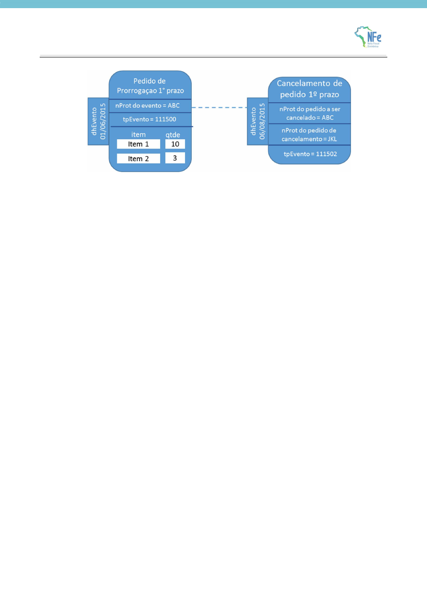

<!-- p.18 -->
# 3.2. Cancelamento

Se a empresa quiser desfazer o pedido de prorrogação (1º ou 2º prazo), pode enviar um evento pedindo seu cancelamento, porém, deverá observar a seguinte regra para cancelar eventos de Pedido de Prorrogação 1º prazo.

- **1** - A quantidade de um determinado item prorrogado de 360 a 540 dias (nos eventos de prorrogação 2° prazo) deve sempre ter sido prorrogado de 180 a 360 dias por eventos de prorrogação 1° prazo. Por isso, para a solicitação parcial, ao tentar cancelar eventos de prorrogação 1° prazo, deve-se atentar para a quantidade de itens nos eventos de prorrogação de 2° prazo. É preciso que existam itens prorrogados no primeiro prazo (até 360 dias) suficientes para que as prorrogações a partir de 360 dias sejam compatíveis.

Considerando como exemplo os dados do item 1.1, não é possível cancelar o Pedido de Prorrogação 1º prazo sem antes cancelar o Pedido de Prorrogação 2º prazo. Neste caso, para realizar este cancelamento a empresa deverá seguir os seguintes passos:

- **1** - Solicitar evento de Cancelamento de Pedido de Prorrogação 2º prazo e, após deferimento deste;
- **2** - Solicitar evento de Cancelamento de Pedido de Prorrogação 1º prazo

O evento de cancelamento, além de vinculado à NFe de remessa, também está vinculado ao evento de prorrogação que se pretende cancelar. Este vínculo ocorre pelo ID do evento e pelo protocolo de registro do evento.
