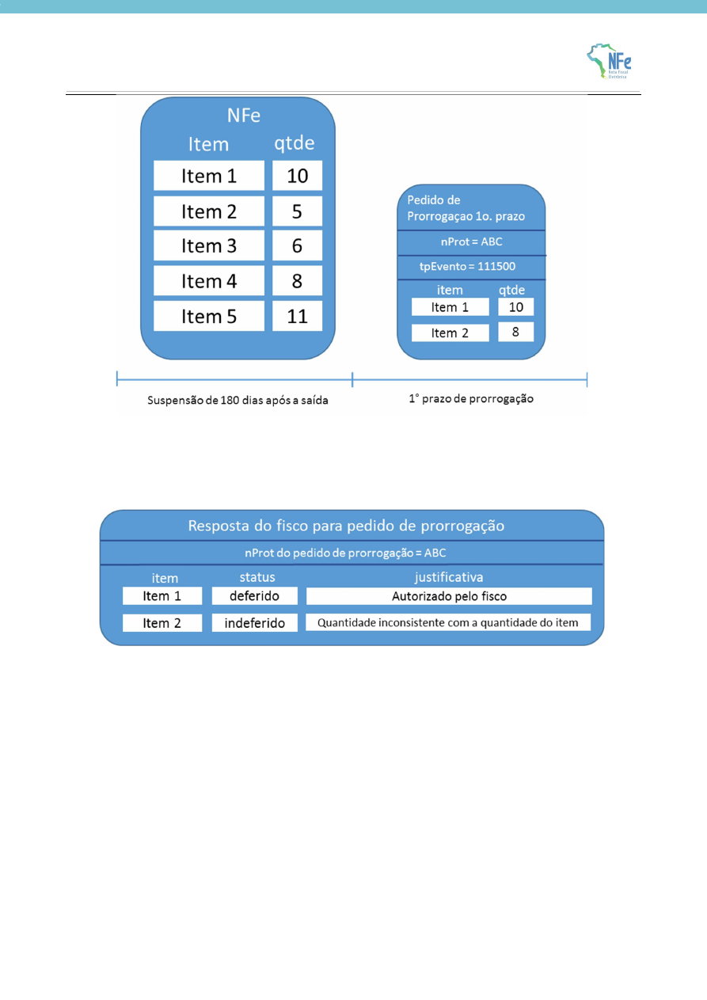

<!-- p.19 -->
# 3.4. Exemplo de pedido de prorrogação e evento com resposta do fisco para a solicitação parcial

<!-- p.20 -->

A empresa pediu a prorrogação de 8 unidades do item 2. Porém, a NFe de remessa contém apenas 5 unidades do item 2. O evento de resposta para o pedido de prorrogação com nProt = ABC autoriza a prorrogação de prazo para 10 unidades do item 1 e indefere o pedido de prorrogação para o item 2.

