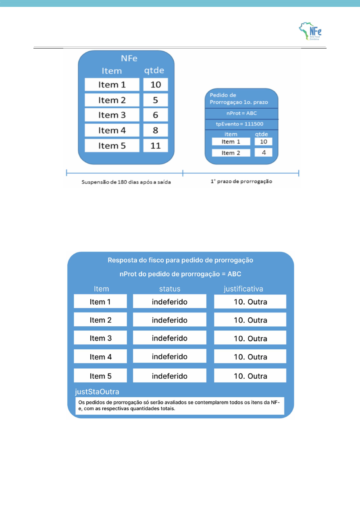

<!-- p.20 -->
# 3.5. Exemplo de pedido de prorrogação e evento com resposta do fisco para a solicitação completa

<!-- p.21 -->

A empresa pediu a prorrogação de apenas 2 itens da nota e 4 unidades do item 2. Porém, é necessário realizar o pedido de prorrogação para todos os itens e quantidades da nota. O evento de resposta para o pedido de prorrogação com nProt = ABC indefere o pedido de prorrogação para todos os itens.

