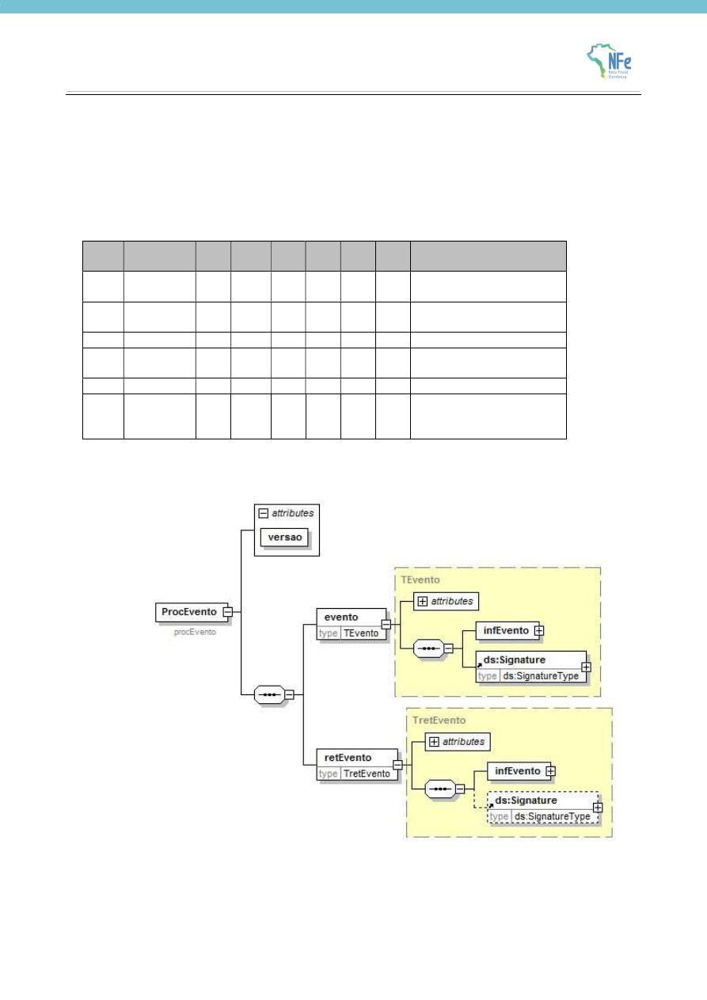

<!-- p.47 -->
# 7.9. Armazenamento e Disponibilização do Cancelamento de Pedido de Prorrogação

O emissor deve manter o arquivo digital do Cancelamento do Pedido de Prorrogação com a informação de Registro do Evento da SEFAZ na forma que segue:

Schema XML: procEventoNFe_v99.99.xsd

| # | Campo | Ele | Pai | Tipo | Descrição/Observação |
|---|---|---|---|---|---|
| **ZR01** | **procEventoNFe** | **Raiz** | **-** | **-** | **TAG raiz** |
| ZR02 | versao | A | ZR01 | N | |
| ZR03 | evento | G | ZR01 | - | |
| YR04 | (dados) | - | - | - | Dados do Evento (mensagem de entrada) |
| YR05 | retEvento | G | ZR01 | - | |
| YR06 | (dados) | - | - | - | Dados do registro do Evento (mensagem de saída) |

Diagrama simplificado do procEventoNFe

O arquivo digital do Cancelamento de Pedido de Prorrogação com a respectiva informação de Registro do Evento da SEFAZ faz parte integrante da NF-e e deve ser disponibilizado para o destinatário.
