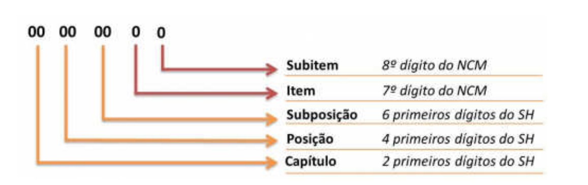

<!-- p.2 -->
# 2. Introdução

Esta nota técnica tem como objetivo adequar a NF-e ao Projeto do Portal Único do Comércio Exterior, padronizando a **Tabela de Unidades de Medidas Tributáveis no Comércio Exterior**, conforme o código **NCM (Nomenclatura Comum do Mercosul)** da <!-- p.3 -->mercadoria a que se refere, com base nas unidades recomendadas pela **Organização Mundial de Aduanas (OMA)**.

Nesses termos, esta nota técnica não tem nenhuma vinculação com a consulta pública realizada pelas Secretarias de Fazenda para padronização das unidades de medidas comerciais, bem como as alterações propostas não se aplicam a NFC-e e nem às empresas emissoras de NF-e que não operam com o Comércio Exterior.

A **OMA** é a única organização internacional intergovernamental que trata de procedimentos aduaneiros concernentes ao comércio entre os países.

Sua missão é melhorar a eficácia e a eficiência das Aduanas em suas atividades de recolhimento de receitas, proteção ao consumidor, defesa do meio ambiente, combate ao tráfico de drogas e à lavagem de dinheiro, entre tantas outras.

O Brasil é representado na **OMA** pela **Secretaria da Receita Federal do Brasil (RFB)** com o apoio do **Ministério das Relações Exteriores (MRE)**.

O **SH (Sistema Harmonizado)** ou Sistema Harmonizado de Designação e Codificação de Mercadoria é um sistema de classificação internacional de mercadorias, criado e mantido pela **OMA**, que contém uma estrutura de códigos com a descrição de características específicas dos produtos, como por exemplo, materiais que o compõe e sua aplicação, para ser utilizado pelos fabricantes, transportadores, exportadores, importadores e alfândegas, de maneira a permitir uma classificação uniformizada das mercadorias no mercado internacional. Esse sistema é utilizado por mais de 190 países para elaborar suas tarifas aduaneiras e estabelecer estatísticas comerciais internacionais. Mais de 98% das mercadorias comercializadas no mundo são classificadas com base na nomenclatura do SH.

O **SH** possibilita a classificação de todo e qualquer produto em um **código de 6 dígitos**.

A **NCM** foi criada no âmbito do Mercosul, para uso próprio do bloco, e teve como base o **SH** e serviu de base para a criação da tarifa aduaneira utilizada pelos países do Mercosul, denominada **Tarifa Externa Comum (TEC)**. O código **NCM** é um **código de 8 dígitos**.

Qualquer mercadoria, importada ou comprada no Brasil, deve ter um código **NCM** na sua documentação legal (nota fiscal, livros legais, etc.), cujo objetivo é classificar os itens de acordo com regulamentos do Mercosul.

Dos 8 dígitos que compõem a **NCM**, os 6 primeiros são classificações do **SH**. Os dois últimos dígitos fazem parte das especificações próprias do Mercosul.

<!-- p.4 -->

*Figura – Estrutura do código NCM: capítulo (2 primeiros dígitos do SH), posição (4 primeiros dígitos do SH), subposição (6 primeiros dígitos do SH), item (7º dígito do NCM) e subitem (8º dígito do NCM).*
