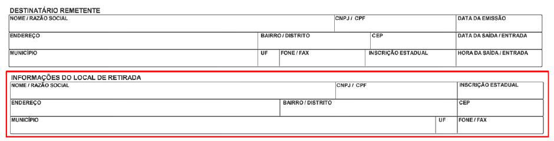
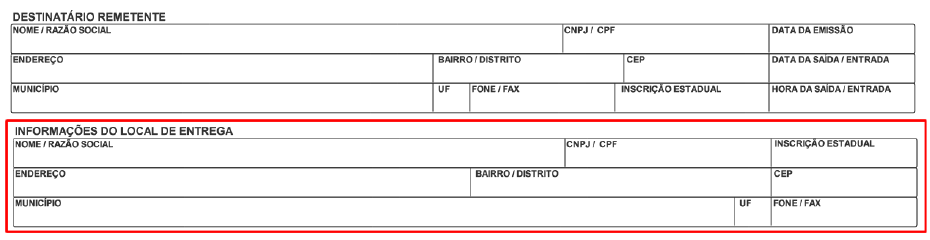

<!-- p.26 -->
# 5. Alteração do DANFE

## 5.1 Quadro do Transportador

O campo identificação da Modalidade do Frete (id: X02, tag:modFrete) deverá ser preenchido com um dos seguintes códigos (NT 2016/002):

- 0=Contratação do Frete por conta do Remetente (CIF);
- 1=Contratação do Frete por conta do Destinatário (FOB);
- 2=Contratação do Frete por conta de Terceiros;
- 3=Transporte Próprio por conta do Remetente;
- 4=Transporte Próprio por conta do Destinatário;
- 9=Sem Ocorrência de Transporte.

## 5.2 Informações do local de retirada

Caso haja preenchimento do grupo F - Local de retirada, fica possibilitada a exibição de informações no DANFE em área especifica, conforme sugestão de modelo abaixo:

*Figura 5.2 – Sugestão de modelo do DANFE: informações do local de retirada*

<!-- p.27 -->
## 5.3 Informações do local de entrega

Caso haja preenchimento do grupo G - Local de entrega, fica possibilitada a exibição de informações no DANFE em área especifica, conforme sugestão de modelo abaixo:

*Figura 5.3 – Sugestão de modelo do DANFE: informações do local de entrega*
