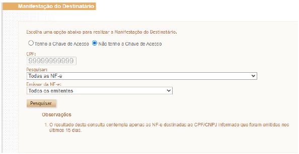
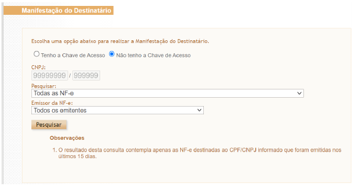
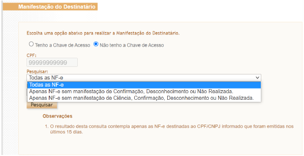
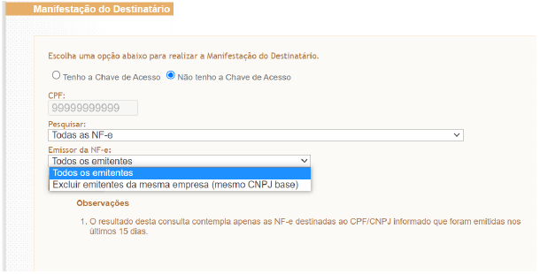

<!-- p.8 -->
# 6.1.2 Manifestação do destinatário sem chave de acesso

Nesta opção de assinalar “Não tenho chave de acesso”, será mostrado na tela as NF-e emitidas nos últimos 15 dias e destinadas ao CPF ou CNPJ de 14 dígitos do certificado digital informado.

Entretanto, caso o certificado digital seja de pessoa jurídica, somente é possível realizar a manifestação do destinatário de NF-e destinada ao CNPJ de 14 dígitos do certificado digital. Ex: certificado digital do CNPJ 99.999.999/0002-99 não consegue realizar manifestação de NF-e destinada ao CNPJ 99.999.999/0004-99.

*Figura 4: Tela da manifestação do destinatário sem chave de acesso para pessoa física*

<!-- p.9 -->

*Figura 5: Tela da manifestação do destinatário sem chave de acesso para pessoa jurídica*

*Figura 6: Opções de pesquisa da manifestação do destinatário sem chave de acesso para pessoa física. As mesmas opções aparecem para pessoa jurídica*

*Figura 7: Opção de excluir emitentes da mesma empresa na manifestação do destinatário sem chave de acesso para pessoa física. As mesmas opções aparecem para pessoa jurídica.*
