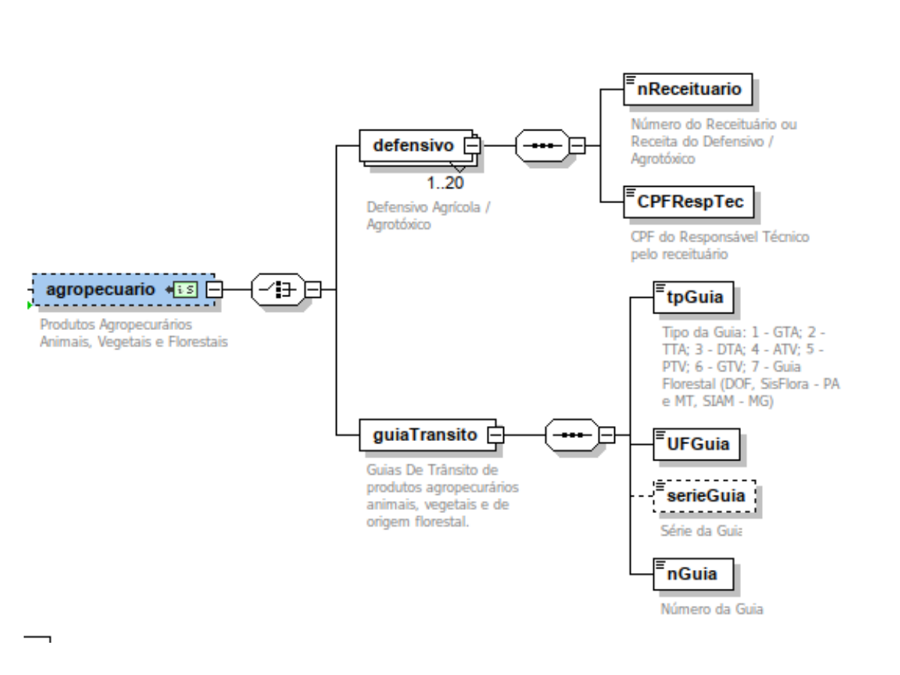

<!-- p.7 -->
# 2.1 Esquema gráfico do leiaute

*Figura 1 – Esquema gráfico do leiaute do grupo ZF (agropecuario): defensivo (nReceituario, CPFRespTec) e guiaTransito (tpGuia, UFGuia, serieGuia, nGuia).*
