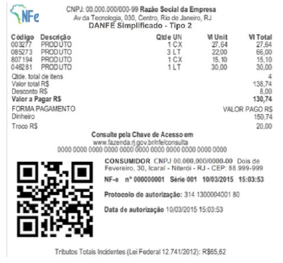
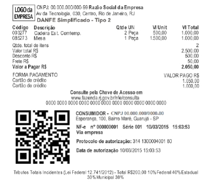
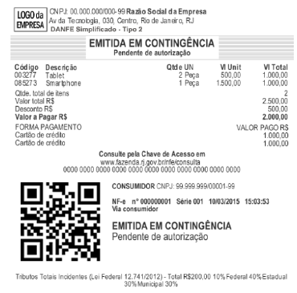
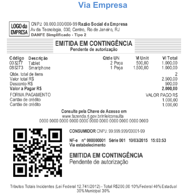

<!-- p.14 -->
# 3.2. Exemplos de DANFE Simplificado Tipo 2

Para facilitar aos emissores e aos desenvolvedores de NF-e apresentamos a seguir alguns exemplos hipotéticos de DANFE Simplificado Tipo 2.

**Exemplo 1:** DANFE Simplificado Tipo 2 normal com vários itens e com logo NF-e

**Exemplo 2:** DANFE Simplificado Tipo 2 com 2 itens, 2 formas de pagamento, desconto, frete (ou taxa de entrega), operação não presencial e com identificação do consumidor (com endereço entrega) e logo da empresa.

<!-- p.15 -->

**Exemplo 3:** DANFE Simplificado Tipo 2 com Logo da Empresa, NF-e Contingência com 2 itens, 2 formas de pagamento e com identificação do consumidor.

*Via Consumidor*

<!-- p.16 -->

*Via Empresa*
