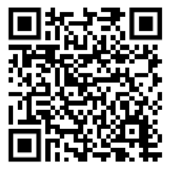
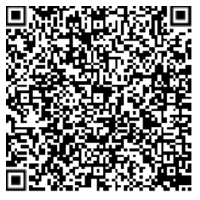

<!-- p.18 -->
# 4.3. Geração da imagem do QR Code para o DANFE Simplificado Tipo 2

A imagem do QR Code deverá ser impressa no DANFE Simplificado Tipo 2 com os padrões residentes das impressoras de não impacto (térmica, laser ou deskjet), conforme mostrado no item 3.2, tendo largura e altura mínimas de 25mm x 25mm. A largura e altura mínimas foram definidas conforme testes realizados, nos quais o leitor de QR Code conseguiu ler a imagem.

A imagem do QR Code deverá conter uma URL composta com as seguintes informações:

- **1ª parte** Endereço do site da Secretaria da Fazenda de localização do emitente da NF-e. Exemplo: http://www.sefazexemplo.gov.br/nfe/qrcode?p=
- **2ª parte** Parâmetros constantes da tabela 6 para emissão online e da tabela 7 para emissão em contingência off-line, utilizando query string. Parâmetros da consulta a chave de acesso da NF-e separados pelo caractere “|”.

Os endereços de consulta das Unidades Federadas a serem utilizados no QR Code do DANFE Simplificado Tipo 2 em ambiente de produção e ambiente de homologação estão disponíveis no Portal Nacional da NFC-e (http://nfce.encat.org/ -> Desenvolvedor -> URL por UF utilizada QR code) - http://nfce.encat.org/desenvolvedor/qrcode/

A critério da Unidade Federada poderá ser utilizado o mesmo endereço para consulta no ambiente de produção e ambiente de homologação. Neste caso, a distinção entre os ambientes de consulta será feita diretamente pela aplicação da UF, a partir do conteúdo do parâmetro de identificação do ambiente, constante do QR Code.

O QR Code deverá ser impresso com os padrões residentes das impressoras de não impacto (térmica, laser ou deskjet).

A URL do QR code deverá ser composta de duas maneiras diferentes: uma para NF-e emitidas de forma online (sem contingência), e outra para NF-e emitidas na contingência off-line.

## 4.3.1. Parâmetros da URL do QR Code na emissão ONLINE

Tabela 1: Relação de Parâmetros da URL do QR Code para NF-e ONLINE

| Posição | Descrição do Parâmetro | Bytes | Orientações de preenchimento |
|---|---|---|---|
| 1º | Chave de Acesso da NF-e | 44\* | Informar a chave de acesso da NF-e |
| 2º | Versão do QR Code | 1\* | Para esta versão de documento, preencher com “3”. |
| 3º | Identificação do Ambiente (1 - Produção, 2 - Homologação) | 1\* | Informar valor do campo B24 do leiaute NF-e - tpAmb |

O asterisco (\*) na tabela acima indica que o preenchimento deve ser exato com a quantidade de bytes indicada.

Dessa forma, o modelo da URL na emissão online, será:

```
http://www.sefazexemplo.gov.br/nfe/qrcode?p=<chave_acesso>|<3>|<tpAmb>
```



*Figura 8: QR Code gerado do exemplo hipotético*

## 4.3.2. Parâmetros da URL do QR Code na emissão em contingência OFFLINE

Tabela 2: Relação de Parâmetros da URL do QR Code para NF-e OFFLINE

| Posição | Descrição do Parâmetro | Bytes | Orientações de preenchimento |
|---|---|---|---|
| 1º | Chave de Acesso da NF-e | 44\* | Informar a chave de acesso da NF-e |
| 2º | Versão do QR Code | 1\* | Para esta versão de documento, preencher o com “3”. |
| 3º | Identificação do Ambiente (1 - Produção, 2 - Homologação) | 1\* | Informar valor do campo B24 do leiaute NF-e-tpAmb |
| 4º | Dia da data de emissão | 2\* | Informar o dia da data de emissão, que consta no campo B09 do leiaute NF-e. O valor deverá ter exatamente dois dígitos. |

<!-- p.20 -->

| Posição | Descrição do Parâmetro | Bytes | Orientações de preenchimento |
|---|---|---|---|
| 5º | Valor Total da NF-e | 15 | Informar valor do campo W16 do leiaute NF-e. O valor deve ser informado com ponto (“.”) como separador decimal; não informar separador de milhar ou sinais. |
| 6º | Tipo de Identificação do Destinatário | 1 | 1=CNPJ; 2=CPF; 3=idEstrangeiro |
| 7º | Identificação do Destinatário | 3-14 | Identificação do Destinatário CNPJ, CPF na NF-e.<br>Caso Destinatário estrangeiro, informar apenas o separador “\|” |
| 8º | Assinatura | | Assinatura digital da concatenação dos parâmetros de 1 a 7, mantendo os separadores (“\|”).<br>Assinatura no padrão RSA SHA-1 (Base64), com o mesmo certificado digital que assina a NF-e.<br>Este parâmetro deve ser adicionado aos demais usando um caractere “\|” como separador. |

O asterisco (\*) na tabela acima indica que o preenchimento deve ser exato com a quantidade de bytes indicada.

Dessa forma, o modelo da URL na emissão contingência offline, será:

```
http://www.sefazexemplo.gov.br/nfe/qrcode?p=<chave_acesso>|<3>|<tpAmb>|<dia_data_emissao>|<vNF>|<tp_idDest>|<idDest>|ZZSKiypy7fkg22MUv6TUh71EI+wLYWr/fUHJy3PyWnL7d5mzEqtxu6bVbhE7AeNiDTirh1u9gVfC2Hw+Lsno2XNL5FRUc5NcuMTT2hA6E9HYC9gryvtWAIgiCZUNG5cWWLCh0G62QdnNe8iSrlSooQu9Z5g1vbGaTFMxaugzzvo=
```



*Figura 9: QR Code gerado do exemplo hipotético*
