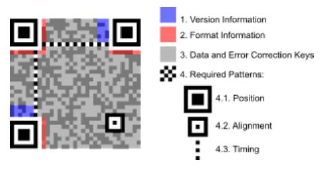

<!-- p.16 -->
# 4. QR Code do DANFE Simplificado Tipo 2

<!-- p.17 -->

O QR code é um código de barras bidimensional que foi criado em 1994 pela empresa japonesa Denso-Wave. QR significa "quick response" devido à capacidade de ser interpretado rapidamente. Esse tipo de codificação permite que possa ser armazenada uma quantidade significativa de caracteres:

- **Numéricos:** 7.089
- **Alfanumérico:** 4.296
- **Binário (8 bits):** 2.953

O QR code a ser impresso no DANFE Simplificado Tipo 2 da NF-e seguirá o padrão internacional ISO/IEC 18004.

Figura 7: Padrão da imagem do QR Code - Fonte: Wikipédia

O QR Code deverá existir no DANFE Simplificado Tipo 2 relativo à emissão em operação normal ou em contingência.

A impressão do QR Code no DANFE Simplificado Tipo 2 tem a finalidade de facilitar a consulta dos dados do documento fiscal eletrônico pelos adquirentes, mediante leitura com o uso de aplicativo leitor de QR Code, instalado em smartphones ou tablets.

Atualmente, existem no mercado inúmeros aplicativos gratuitos para smartphones que possibilitam a leitura de QR Code.

Esta tecnologia tem sido amplamente difundida e é de crescente utilização como forma de comunicação.
