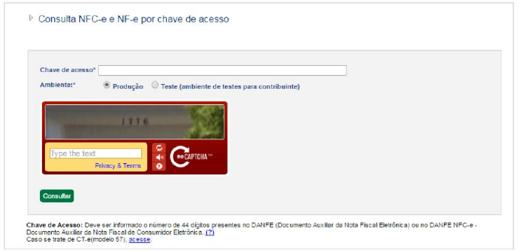

<!-- p.22 -->
# 5.1. Consulta Pública de NF-e via Digitação de Chave de Acesso

O endereço que deve estar impresso no DANFE Simplificado Tipo 2 destinado à consulta utilizando a chave de acesso, está indicado por cada Unidade Federada, e consta do Portal Nacional.

A URL da consulta por chaves da NF-e deve constar do arquivo da NF-e (XML) em ZX-03, tag: urlChave, no grupo de Informações Suplementares da Nota Fiscal. Estas URL estão disponíveis no Portal Nacional da NFC-e - http://NFC-e.encat.org/ na opção "Consumidor" - "Consulte sua Nota".

Nesta hipótese o consumidor deverá acessá-los pela internet e digitar a chave de acesso composta por 44 caracteres.

Figura 10: Tela de consulta da NF-e com digitação da chave de acesso

Como resultado da consulta pública, deverá ser apresentado ao consumidor a consulta da NF-e.
