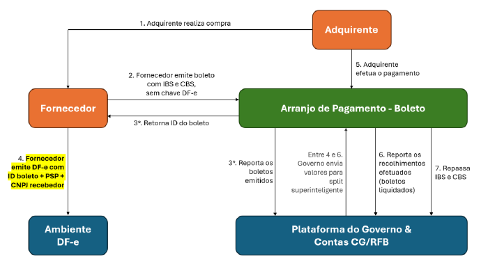
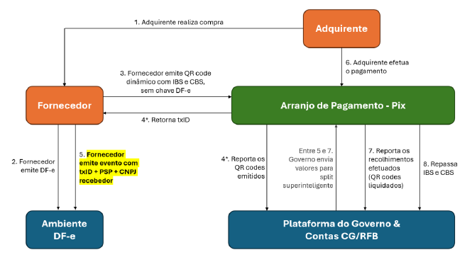

<!-- p.4 -->
# 1. Introdução

A vinculação entre DF-e e transação financeira sujeita ao split payment é estritamente necessária para a correta apuração dos débitos do fornecedor e concessão de créditos ao adquirente.

No split payment, há duas formas de o contribuinte indicar a vinculação entre o documento fiscal e a transação financeira sujeita ao split payment:

i. transmitindo a chave do documento fiscal ao prestador de serviço de pagamento, no início da transação financeira;
ii. informando os dados da transação financeira em campos ou em Evento de DF-e.

Esta Nota Técnica detalha a forma (ii), de vinculação por meio da inserção de dados da transação financeira em campos de documento fiscal ou Evento.

**Atenção:** O vínculo indicado pelo contribuinte não necessariamente representa um pagamento efetuado e liquidado. Indica uma expectativa de pagamento que pode ou não se concretizar. Por exemplo: um boleto pode ser emitido e não pago.

Nas transações sujeitas ao procedimento padrão do split payment e originadas por fornecedor/recebedor, a vinculação se faz necessária antes mesmo da liquidação financeira, com o propósito de viabilizar o split payment superinteligente. Cumpre destacar que, quanto mais tempo o fornecedor/recebedor demorar para reportar o vínculo entre DF-e e transação financeira, menores serão as chances de o split superinteligente ser executado. Em caso de impossibilidade de execução do split superinteligente, será executado o split inteligente offline, com posterior devolução de valores retidos a maior no prazo de 3 (três) dias úteis.

São exemplos, não exaustivos, de possíveis cenários de vinculação por meio da inserção de dados da transação financeira em campos ou em Evento de DF-e:

**Ex. 1.** O fornecedor emite um boleto para o adquirente antes da emissão do DF-e. Uma vez que o boleto foi emitido sem chave de DF-e, a vinculação fica inicialmente pendente. Após a emissão do boleto, o fornecedor emite o DF-e preenchendo os campos relativos à transação financeira, viabilizando assim a vinculação.

<!-- p.5 -->

*Figura 1 – Fluxo do exemplo 1 (vinculação por boleto emitido antes do DF-e).*

**Ex. 2.** O fornecedor emite um DF-e. Em seguida, o fornecedor emite QR code Pix dinâmico para a empresa adquirente, informando valores de IBS e CBS, mas sem a chave do DF-e previamente emitido (nos termos do § 2º-A do Art. 32 da LC 214/2025, com redação dada pela LC 227/2026). O vínculo fica inicialmente pendente, em razão da ausência da chave DF-e na transação de pagamento. Para finalmente efetivar a vinculação, o fornecedor emite Evento atrelado ao DF-e, com os dados do Pix dinâmico.

*Figura 2 – Fluxo do exemplo 2 (vinculação por QR code Pix dinâmico).*

**Ex. 3.** O fornecedor emite um DF-e antes do início da transação financeira. A empresa adquirente efetua o pagamento via TED informando a chave do DF-e, porém comete um erro neste preenchimento, o que impede a correta vinculação entre transação financeira e DF-e.

<!-- p.6 -->
A fim de resolver o problema, o fornecedor emite um Evento atrelado ao DF-e com os dados da transação financeira.
